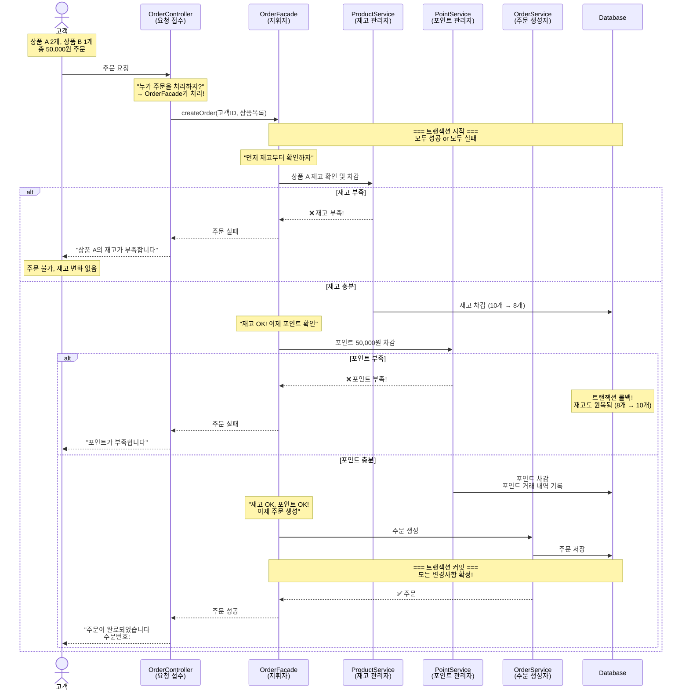
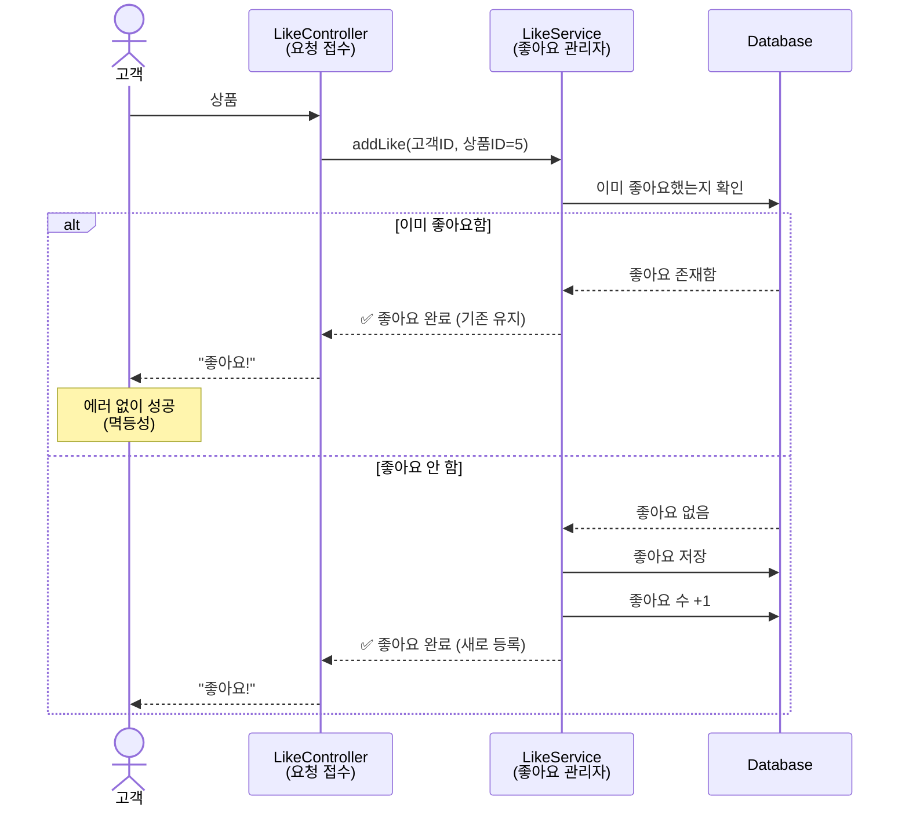
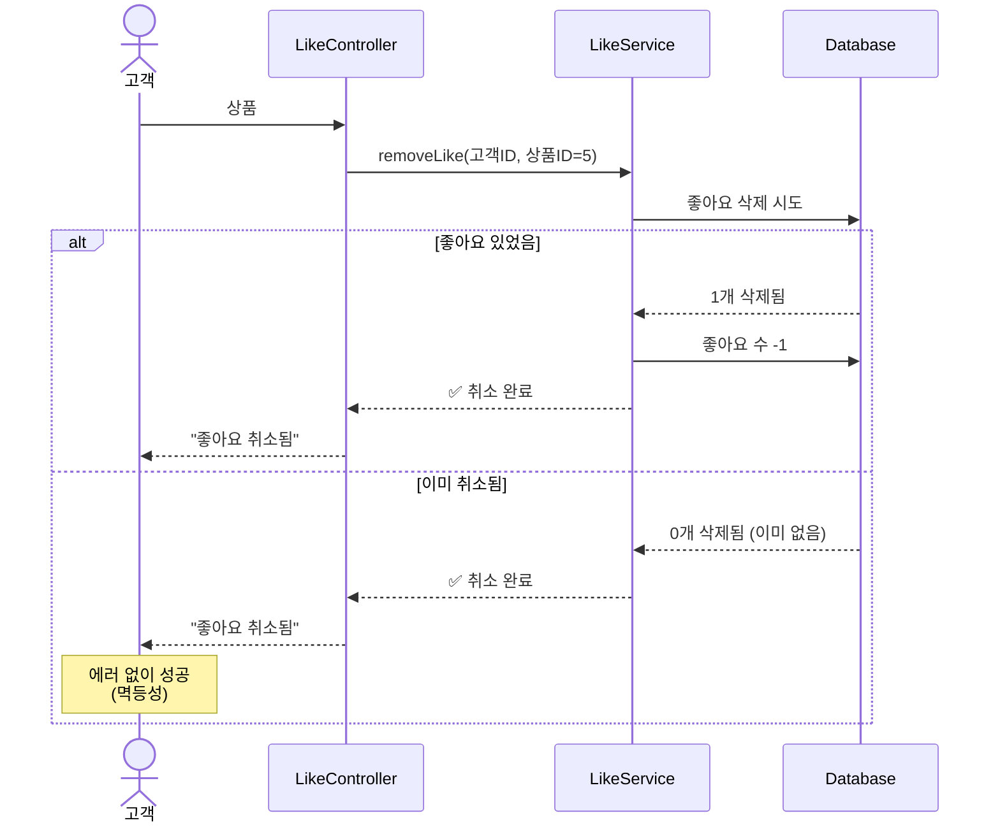
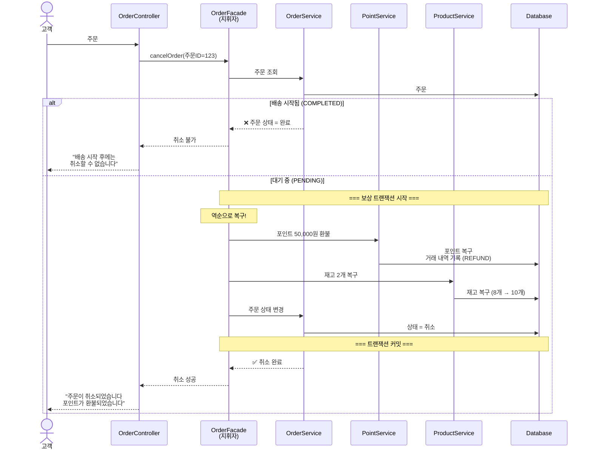
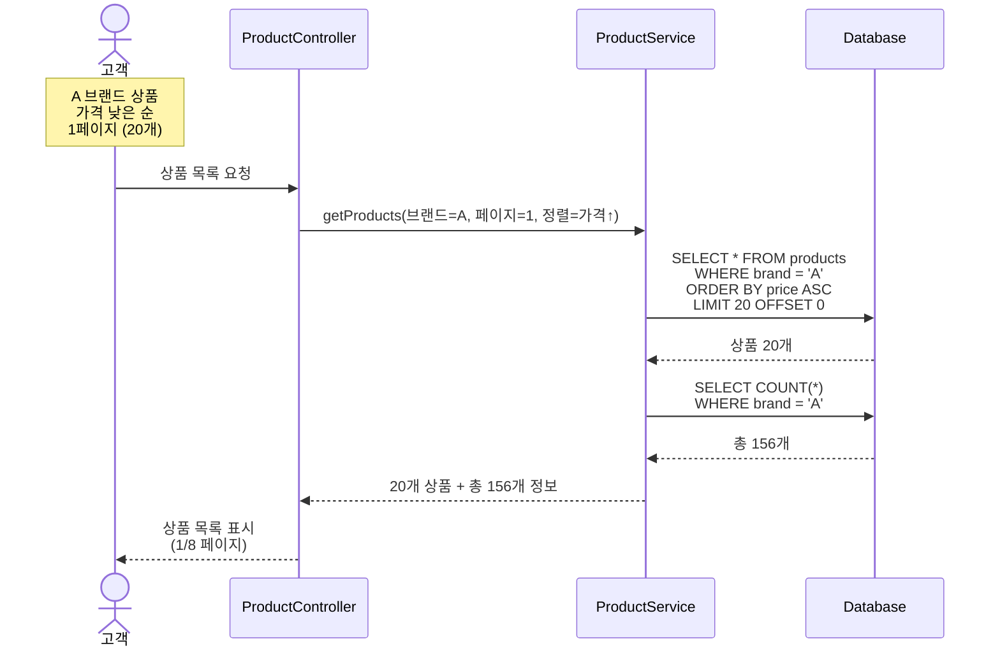

# 시퀀스 다이어그램 (Sequence Diagrams)

> 각 기능이 **어떻게 동작하는지**, **누가 무엇을 책임지는지**를 시각화한 문서입니다.

---

## 📌 문서의 목적

### 이 문서는 왜 필요한가?

코드를 작성하기 전에 `"누가 무엇을 해야 하는가"`를 먼저 정리하지 않으면 다음과 같은 문제가 발생할 수 있다고 생각합니다.
- 한 클래스에 모든 로직이 집중됨 (책임 과중)
- 객체 간 협력 구조가 복잡해짐
- 변경이 어려워짐 (한 곳을 고치면 여러 곳이 깨짐)

시퀀스 다이어그램은 **코드보다 빠르게** 설계를 공유하고 검토할 수 있는 도구라고 생각합니다.

## 🎭 등장인물 (참여자)

### 각 참여자의 역할

```
┌─────────────┐
│   고객       │  → 실제 서비스를 사용하는 사람 (액터)
└─────────────┘

┌─────────────┐
│ Controller  │  → HTTP 요청을 받아서 적절한 서비스로 전달
└─────────────┘  → "누가 이 기능을 처리하지?"를 결정

┌─────────────┐
│   Facade    │  → 여러 도메인을 조율하는 지휘자
└─────────────┘  → "A도 하고, B도 하고, C도 해!"

┌─────────────┐
│  Service    │  → 단일 도메인의 비즈니스 로직 실행
└─────────────┘  → "내 영역에서는 이렇게 처리해!"

┌─────────────┐
│  Domain     │  → 비즈니스 규칙을 담은 핵심 객체
└─────────────┘  → "나는 이 규칙에 따라 움직여!"

┌─────────────┐
│ Repository  │  → 데이터베이스와 통신
└─────────────┘  → "데이터를 저장하고 불러올게!"
```

## 🎯 핵심 시퀀스 다이어그램

---

## 1. 주문 생성 (Order Creation)

### 💭 해결하려는 문제

**상황**
```
고객: "상품 3개 주문할게요!"

시스템이 해야 할 일:
1. 재고가 충분한지 확인
2. 재고 차감
3. 포인트가 충분한지 확인
4. 포인트 차감
5. 주문 생성

만약 중간에 하나라도 실패하면?
→ 이전 단계도 모두 취소해야 함!
```

**어려운 이유**
- 여러 도메인(상품, 포인트, 주문)이 협력해야 함
- 하나라도 실패하면 전체가 취소되어야 함 (원자성)
- 각 도메인의 책임을 명확히 분리해야 함

### 🎬 실행 흐름



### 💡 핵심 포인트

**1. 책임 분리 (Separation of Concerns)**

```
OrderFacade (지휘자):
"나는 전체 흐름만 조율할게"
- 재고 처리는 ProductService에게
- 포인트 처리는 PointService에게
- 주문 생성은 OrderService에게

각 Service (전문가):
"내 분야는 내가 제일 잘 알아"
- ProductService: 재고 관리 전문가
- PointService: 포인트 관리 전문가
- OrderService: 주문 생성 전문가
```

**2. 트랜잭션 (All or Nothing)**

```
[성공 시]
재고 차감 ✅
포인트 차감 ✅  
주문 생성 ✅
→ 모두 확정!

[실패 시]
재고 차감 ✅
포인트 차감 ❌
→ 재고 차감도 취소!
→ 처음 상태로 되돌아감
```

**3. 왜 이렇게 설계했나?**

```
Q: 왜 Facade가 필요한가요? Service가 직접 하면 안 되나요?

A: 각 Service는 자기 분야만 집중해야 합니다.
   - ProductService는 포인트를 몰라도 됨
   - PointService는 재고를 몰라도 됨
   - 둘을 조율하는 건 Facade의 역할!

Q: 트랜잭션은 어디서 시작하나요?

A: Facade에서 시작합니다.
   - @Transactional 어노테이션 사용
   - Facade 메서드가 끝나면 커밋/롤백 결정
```

---

## 2. 상품 좋아요 등록 (Product Like)

### 💭 해결하려는 문제

**상황**
```
고객: "이 상품 마음에 들어! 좋아요 누르자"
(클릭)
고객: "아, 실수로 또 눌렀네"
(클릭)

시스템은 어떻게 반응해야 할까?
→ 중복 좋아요로 에러를 내면 고객이 당황함
→ 멱등하게 처리해야 함 (여러 번 눌러도 한 번만 등록)
```

### 🎬 실행 흐름



### 💡 핵심 포인트

**1. 멱등성 (Idempotency)**

```
멱등하다 = 여러 번 실행해도 결과가 같다

[나쁜 예]
1번 클릭: 좋아요 1개
2번 클릭: 에러! "이미 좋아요했습니다"
→ 고객 혼란

[좋은 예]
1번 클릭: 좋아요 1개
2번 클릭: 좋아요 1개 (그대로)
→ 고객 만족
```

**2. 왜 이렇게 설계했나?**

```
Q: 중복 좋아요 시도를 에러로 처리하면 안 되나요?

A: 사용자 경험이 나빠집니다.
   - 네트워크 지연으로 같은 요청이 여러 번 갈 수 있음
   - 고객이 실수로 여러 번 클릭할 수 있음
   - "이미 좋아요함"도 결국 "좋아요 상태"이므로 성공!

Q: 좋아요 수는 어떻게 관리하나요?

A: 두 가지 방법이 있습니다.
   1. likes 테이블에서 COUNT(*) 실시간 계산
   2. products 테이블에 like_count 컬럼 관리
   → 성능을 위해 보통 2번 선택
```

---

## 3. 상품 좋아요 취소 (Product Unlike)

### 💭 해결하려는 문제

```
고객: "이 상품 별로네, 좋아요 취소하자"
(클릭)
고객: "어? 또 눌렀네"
(클릭)

등록과 마찬가지로 취소도 멱등해야 함!
```

### 🎬 실행 흐름



### 💡 핵심 포인트

**최종 상태가 중요하다**

```
목표: "좋아요 없음" 상태 만들기

[케이스 1]
좋아요 있음 → 취소 → 좋아요 없음 ✅

[케이스 2]
좋아요 없음 → 취소 → 좋아요 없음 ✅

둘 다 결과는 "좋아요 없음"이므로 성공!
```

---

## 4. 주문 취소 (Order Cancellation)

### 💭 해결하려는 문제

**상황**
```
[주문 생성 시 했던 일]
1. 재고 차감 (10개 → 8개)
2. 포인트 차감 (100,000원 → 50,000원)
3. 주문 생성 (주문 #123)

[취소 시 해야 할 일]
→ 위에서 한 일을 모두 원래대로!
1. 포인트 환불 (50,000원 → 100,000원)
2. 재고 복구 (8개 → 10개)
3. 주문 상태 변경 (대기 → 취소)
```

### 🎬 실행 흐름



### 💡 핵심 포인트

**보상 트랜잭션 (Compensating Transaction)**

```
[생성 시 순서]
Step 1: 재고 차감
Step 2: 포인트 차감
Step 3: 주문 생성

[취소 시 순서 (역순)]
Step 1: 포인트 환불
Step 2: 재고 복구
Step 3: 주문 상태 변경

왜 역순?
→ 의존성 때문!
→ 주문이 있어야 포인트/재고를 복구할 수 있음
```

---

## 5. 상품 목록 조회 (Product List)

### 💭 해결하려는 문제

**상황**
```
상품이 10,000개 있는데 한 번에 다 조회하면?
→ 너무 느림
→ 메모리 부족
→ 화면에 다 표시할 수도 없음

해결: 페이지네이션
→ 한 번에 20개씩만 조회
→ 필요한 만큼만 가져옴
```

### 🎬 실행 흐름



### 💡 핵심 포인트

**페이지네이션 = 성능 최적화**

```
[나쁜 예]
SELECT * FROM products
→ products 테이블 전부 조회
→ 5초 걸림

[좋은 예]
SELECT * FROM products LIMIT 20 OFFSET 0
→ 20개만 조회
→ 0.1초
```
