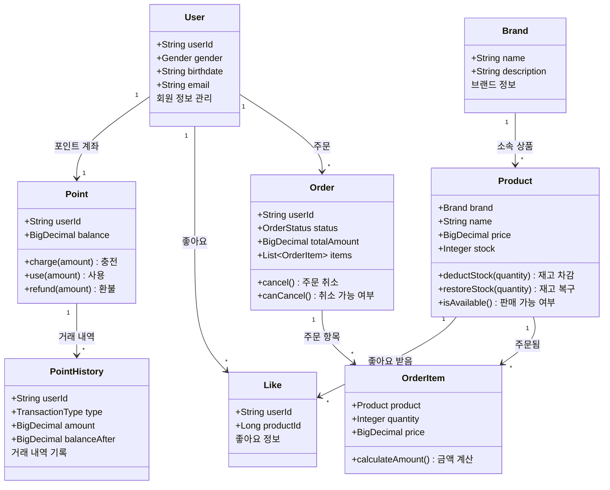
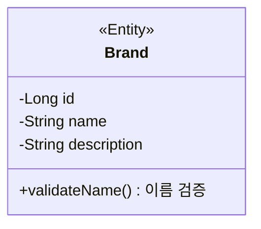
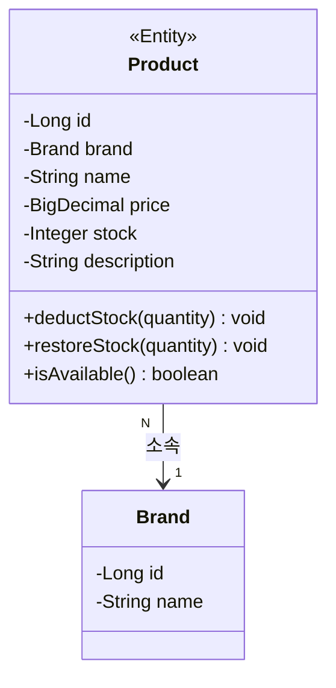
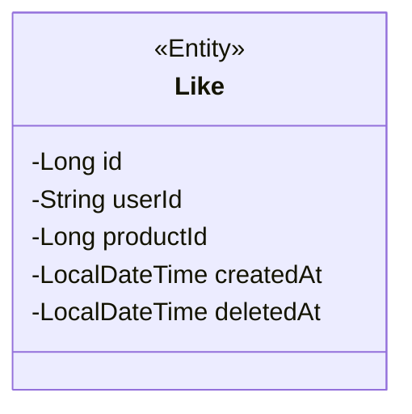
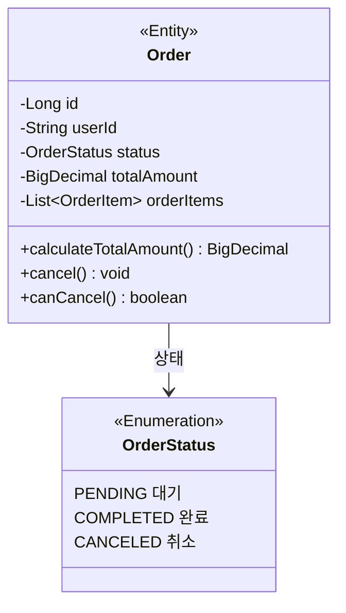
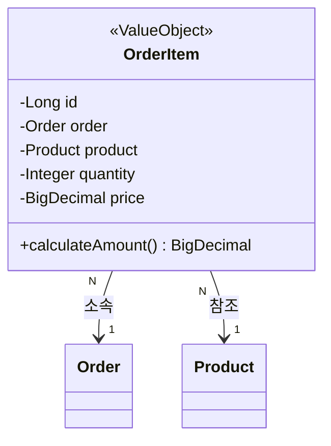
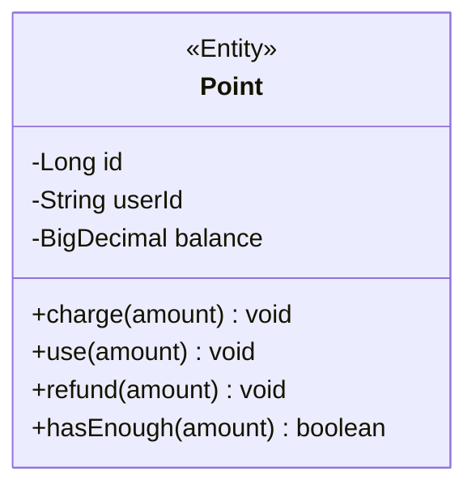
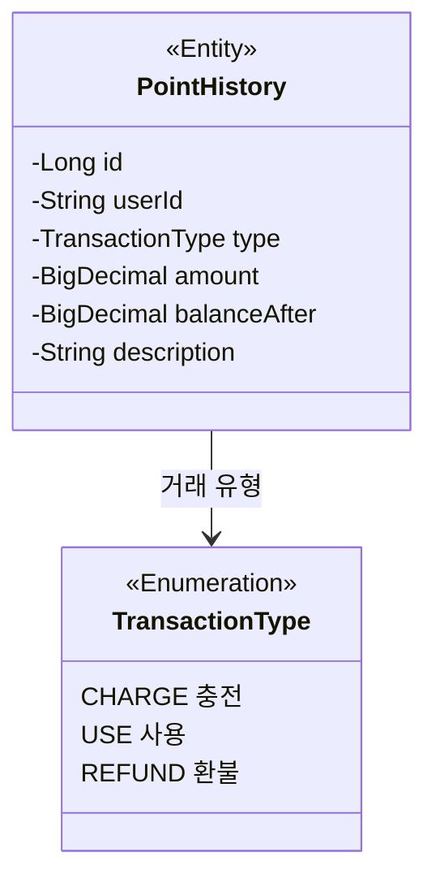

# 클래스 다이어그램 (Class Diagram)

> 각 객체가 **어떤 책임**을 가지고, **어떻게 협력**하는지를 시각화한 문서입니다.

---

## 🎯 도메인 객체 vs 데이터 저장소

### 도메인 객체는 "똑똑한 객체"

```
[나쁜 예 - 빈혈 모델 (Anemic Domain Model)]
class Product {
    private String name;
    private int price;
    private int stock;
    // getter, setter만 있음
}

class ProductService {
    // 모든 로직이 여기에!
    public void deductStock(Product product, int quantity) {
        if (product.getStock() < quantity) {
            throw new Exception("재고 부족");
        }
        product.setStock(product.getStock() - quantity);
    }
}

→ Product는 그냥 데이터 주머니
→ 비즈니스 규칙이 Service에 집중


[좋은 예 - 풍부한 도메인 모델 (Rich Domain Model)]
class Product {
    private String name;
    private int price;
    private int stock;
    
    // 자기 자신의 규칙은 스스로
    public void deductStock(int quantity) {
        if (this.stock < quantity) {
            throw new InsufficientStockException();
        }
        this.stock -= quantity;
    }
    
    public boolean isAvailable() {
        return this.stock > 0;
    }
}

→ Product가 자신의 규칙을 알고 있음
→ Service는 Product를 조율하기만 함
```

**핵심 원칙**: "데이터를 가진 객체가 그 데이터에 대한 로직도 가져야 한다"

---

## 🏗️ 전체 도메인 구조



## 📦 도메인별 상세 설계

---

## 1. 상품 도메인

### 1.1 Brand (브랜드)



**책임**: "브랜드 정보 관리"

| 속성 | 설명 | 예시 |
|---|---|---|
| id | 브랜드 고유 번호 | 1 |
| name | 브랜드명 | "나이키" |
| description | 브랜드 설명 | "스포츠 의류 및 용품" |

**비즈니스 규칙**:
```
✓ 브랜드명은 중복될 수 없음
✓ 브랜드명은 필수
```

---

### 1.2 Product (상품)



**책임**: "상품 정보와 재고 관리"

#### 주요 메서드

**1. deductStock(quantity) - 재고 차감**

```java
// 나쁜 예 - Service에서 처리
class ProductService {
    public void deductStock(Product product, int quantity) {
        if (product.getStock() < quantity) {
            throw new Exception();
        }
        product.setStock(product.getStock() - quantity);
    }
}

// 좋은 예 - Product가 스스로 처리
class Product {
    public void deductStock(int quantity) {
        if (this.stock < quantity) {
            throw new InsufficientStockException(
                "재고 부족: 필요 " + quantity + "개, 현재 " + this.stock + "개"
            );
        }
        this.stock -= quantity;
    }
}
```

**왜 좋은가?**
- 재고 규칙을 Product가 스스로 지킴
- Service는 "deductStock 해줘"라고만 요청 (TDA 원칙)
- 재고 규칙이 변경되어도 Product만 수정하면 됨

**2. isAvailable() - 판매 가능 여부**

```java
public boolean isAvailable() {
    return this.stock > 0 && this.deletedAt == null;
}
```

**왜 필요한가?**
- 재고가 있고, 삭제되지 않은 상품만 판매 가능
- 이 규칙을 아는 건 Product 자신

#### 비즈니스 규칙

| 규칙 | 설명 | 검증 방법 |
|---|---|---|
| 재고는 음수 불가 | 판매할 수 없는 상품을 의미 | `stock >= 0` |
| 가격은 0원 이상 | 무료는 별도 처리 | `price >= 0` |
| 모든 상품은 브랜드 소속 | 출처 불명 상품 방지 | `brand != null` |

---

## 2. 좋아요 도메인

### 2.1 Like (좋아요)



**책임**: "누가 어떤 상품을 좋아요했는지 기록"

#### 특별한 점: 멱등성 보장

```
[문제 상황]
고객이 같은 상품에 좋아요를 2번 클릭

[나쁜 설계]
Like 객체가 2개 생성됨
→ 데이터 중복
→ 좋아요 수가 2개로 계산됨

[좋은 설계] - 가장 단순한
DB에 UNIQUE 제약: (userId, productId)
→ 중복 시 기존 데이터 유지
→ 에러 없이 성공 응답
→ 멱등성 보장
```

#### 비즈니스 규칙

| 규칙 | 설명 | 구현 방법 |
|---|---|---|
| 중복 불가 | 한 사용자는 한 상품에 한 번만 | UNIQUE(userId, productId) |
| Soft Delete | 취소 시 실제 삭제 안 함 | deletedAt 기록 |

---

## 3. 주문 도메인

### 3.1 Order (주문)



**책임**: "주문 정보 관리, 취소 가능 여부"

#### 주요 메서드

**1. canCancel() - 취소 가능 여부**

```java
public boolean canCancel() {
    // 배송 시작 전에만 취소 가능
    return this.status == OrderStatus.PENDING;
}
```

**왜 Order가 판단하는지**
- 취소 가능 여부는 주문 상태에 따라 결정됨
- 이 규칙을 아는 건 `Order` 자신
- `Service`는 "취소 가능해?"라고만 물어봄

**2. cancel() - 주문 취소**

```java
public void cancel() {
    if (!this.canCancel()) {
        throw new IllegalStateException(
            "배송 시작 후에는 취소할 수 없습니다"
        );
    }
    this.status = OrderStatus.CANCELED;
    this.canceledAt = LocalDateTime.now();
}
```

**책임 분리의 예**
```
OrderFacade (지휘자)
"Order야, 취소 가능해?"
"ProductService야, 재고 복구해줘"
"PointService야, 포인트 환불해줘"
"Order야, 이제 취소해"

Order (실행자):
"내가 판단할게. 응, 취소 가능해"
...
"OK, 취소할게"
```

#### 상태 전이 규칙

```
PENDING (대기)
    ↓ 배송 시작
COMPLETED (완료)

PENDING (대기)
    ↓ 고객 취소
CANCELED (취소)

[불가능한 전이]
COMPLETED → CANCELED  ❌ (배송 시작 후 취소 불가)
CANCELED → PENDING    ❌ (취소 후 재주문 불가)
```

---

### 3.2 OrderItem (주문 항목)



**책임**: "주문 항목의 금액 계산"

#### 중요한 개념: 가격 스냅샷

```
[문제 상황]
1. 2025-11-07: 신발 50,000원에 주문
2. 2025-11-08: 신발 가격이 60,000원으로 인상
3. 주문 내역 조회 시 금액이 60,000원으로 표시됨?
→ 주문 당시 가격이 유지되어야 함

[해결]
OrderItem.price = 주문 당시 상품 가격을 저장 (스냅샷)
이후 Product.price가 변경되어도 주문 금액은 불변
```

**왜 이렇게 하는지**
- 주문 후 상품 가격이 변경되어도 주문 금액은 변하지 않음
- 고객과의 약속을 지킴
- 정산 시 금액 불일치 방지

#### 주요 메서드

```java
public BigDecimal calculateAmount() {
    // price: 주문 당시 가격 (스냅샷)
    // quantity: 주문 수량
    return this.price.multiply(BigDecimal.valueOf(this.quantity));
}
```

---

## 4. 사용자/포인트 도메인

### 4.1 Point (포인트)



**책임**: "포인트 잔액 관리, 부족 여부 체크"

#### 주요 메서드

**1. use(amount) - 포인트 사용**

```java
public void use(BigDecimal amount) {
    if (this.balance.compareTo(amount) < 0) {
        throw new InsufficientPointException(
            "포인트 부족: 필요 " + amount + "원, 보유 " + this.balance + "원"
        );
    }
    this.balance = this.balance.subtract(amount);
}
```

**왜 Point가 검증하나?**
- 잔액 부족 여부는 Point가 제일 잘 앎
- Service는 "use 해줘"라고만 요청
- 검증 실패 시 Point가 예외를 던짐

---

### 4.2 PointHistory (포인트 거래 내역)



**책임**: "포인트 거래 기록 및 보관해 (수정 불가)"

#### 특별한 점: 불변 객체 (Immutable)

```
[원칙]
PointHistory는 한 번 생성되면 절대 수정 안 됨

[이유]
- 감사 추적(Audit Trail) 용도
- 고객과의 분쟁 시 증거 자료
- 금융 거래의 특성상 변경 불가

[구현]
- setter 메서드 없음
- 생성자로만 초기화
- 모든 필드 final
```

**balanceAfter 필드의 중요성**
```
거래 내역:
1. 충전 +10,000원 (잔액 후: 10,000원)
2. 사용 -3,000원  (잔액 후: 7,000원)
3. 사용 -2,000원  (잔액 후: 5,000원)

만약 balanceAfter가 없다면?
→ 현재 잔액과 거래 내역이 일치하는지 검증 불가

balanceAfter가 있으면?
→ 각 거래 시점의 잔액을 알 수 있음
→ 데이터 정합성 검증 가능
```

---

## 📊 설계 원칙 정리

### 1. Tell, Don't Ask (묻지 말고 시켜라)

```
[나쁜 예 - Ask]
if (product.getStock() < quantity) {  // 묻기
    throw new Exception();
}
product.setStock(product.getStock() - quantity);  // 직접 변경

[좋은 예 - Tell]
product.deductStock(quantity);  // 시키기
→ Product가 알아서 검증하고 처리
```

### 2. 정보 전문가 (Information Expert)

```
"그 정보를 가진 객체가 그 정보에 대한 로직도 가져야 한다"

✓ 재고 정보를 가진 Product → 재고 차감 로직도 Product에
✓ 포인트 잔액을 가진 Point → 포인트 사용 로직도 Point에
✓ 주문 상태를 가진 Order → 취소 가능 여부 판단도 Order에
```

### 3. 단일 책임 원칙 (SRP)

```
한 클래스는 한 가지 이유로만 변경되어야 한다

Product:
✓ 상품 정보가 변경되면 수정
✗ 주문 로직이 변경되어도 수정 안 함

Order:
✓ 주문 규칙이 변경되면 수정
✗ 포인트 규칙이 변경되어도 수정 안 함
```

### 4. 값 객체 (Value Object)

```
OrderItem은 "값 객체"

특징:
- Order에 종속됨 (독립적으로 존재 불가)
- Order가 삭제되면 함께 삭제됨
- 주문 항목끼리 비교할 일 없음 (ID보다는 값으로 구분)
```

---

## 🔗 객체 간 협력 예시

### 주문 생성 시 객체 협력

```
OrderFacade: "주문 생성 시작!"

1. ProductService에게:
   "Product야, 재고 충분해?"
   Product: "내가 확인할게. 충분해!"
   "그럼 재고 차감해줘"
   Product: "OK, 차감했어"

2. PointService에게:
   "Point야, 포인트 충분해?"
   Point: "내가 확인할게. 충분해!"
   "그럼 포인트 사용해줘"
   Point: "OK, 사용했어"

3. OrderService에게:
   "이제 주문 생성해줘"
   Order: "OK, 주문 생성했어"

→ 각 객체가 자신의 책임을 다함
→ Facade는 흐름만 조율
```
