# 클래스 다이어그램 (Class Diagram)

> 각 객체가 **어떤 책임**을 가지고, **어떻게 협력**하는지를 시각화한 문서입니다.

---

## 🎯 도메인 객체 vs 데이터 저장소

### 도메인 객체는 "똑똑한 객체"

```
[나쁜 예 - 빈혈 모델 (Anemic Domain Model)]
class Product {
    private String name;
    private int price;
    private int stock;
    // getter, setter만 있음
}

class ProductService {
    // 모든 로직이 여기에!
    public void deductStock(Product product, int quantity) {
        if (product.getStock() < quantity) {
            throw new Exception("재고 부족");
        }
        product.setStock(product.getStock() - quantity);
    }
}

→ Product는 그냥 데이터 주머니
→ 비즈니스 규칙이 Service에 집중


[좋은 예 - 풍부한 도메인 모델 (Rich Domain Model)]
class Product {
    private String name;
    private int price;
    private int stock;
    
    // 자기 자신의 규칙은 스스로
    public void deductStock(int quantity) {
        if (this.stock < quantity) {
            throw new InsufficientStockException();
        }
        this.stock -= quantity;
    }
    
    public boolean isAvailable() {
        return this.stock > 0;
    }
}

→ Product가 자신의 규칙을 알고 있음
→ Service는 Product를 조율하기만 함
```

**핵심 원칙**: "데이터를 가진 객체가 그 데이터에 대한 로직도 가져야 한다"

---

## 🏗️ 전체 도메인 구조

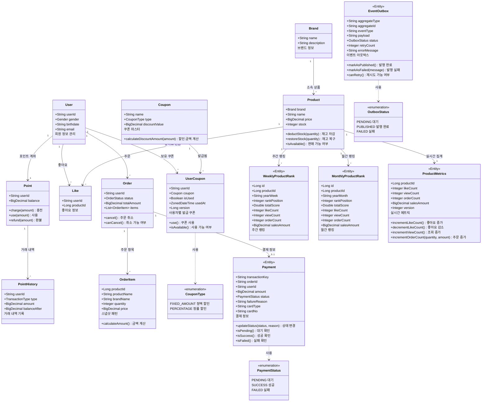
```mermaid
classDiagram
    class User {
        +String userId
        +Gender gender
        +String birthdate
        +String email
        회원 정보 관리
    }

    class Point {
        +String userId
        +BigDecimal balance
        +charge(amount) 충전
        +use(amount) 사용
        +refund(amount) 환불
    }

    class PointHistory {
        +String userId
        +TransactionType type
        +BigDecimal amount
        +BigDecimal balanceAfter
        거래 내역 기록
    }

    class Brand {
        +String name
        +String description
        브랜드 정보
    }

    class Product {
        +Brand brand
        +String name
        +BigDecimal price
        +Integer stock
        +deductStock(quantity) 재고 차감
        +restoreStock(quantity) 재고 복구
        +isAvailable() 판매 가능 여부
    }

    class Like {
        +String userId
        +Long productId
        좋아요 정보
    }

    class Order {
        +String userId
        +OrderStatus status
        +BigDecimal totalAmount
        +List~OrderItem~ items
        +cancel() 주문 취소
        +canCancel() 취소 가능 여부
    }

    class OrderItem {
        +Long productId
        +String productName
        +String brandName
        +Integer quantity
        +BigDecimal price
        +calculateAmount() 금액 계산
        스냅샷 패턴
    }

    class Coupon {
        +String name
        +CouponType type
        +BigDecimal discountValue
        +calculateDiscountAmount(amount) 할인 금액 계산
        쿠폰 마스터
    }

    class UserCoupon {
        +String userId
        +Coupon coupon
        +Boolean isUsed
        +ZonedDateTime usedAt
        +Long version
        +use() 쿠폰 사용
        +isAvailable() 사용 가능 여부
        사용자별 발급 쿠폰
    }

    class CouponType {
        <<enumeration>>
        FIXED_AMOUNT 정액 할인
        PERCENTAGE 정률 할인
    }

    User "1" --> "1" Point : 포인트 계좌
    Point "1" --> "*" PointHistory : 거래 내역
    Brand "1" --> "*" Product : 소속 상품
    User "1" --> "*" Like : 좋아요
    Product "1" --> "*" Like : 좋아요 받음
    User "1" --> "*" Order : 주문
    Order "1" --> "*" OrderItem : 주문 항목
    User "1" --> "*" UserCoupon : 보유 쿠폰
    Coupon "1" --> "*" UserCoupon : 발급됨
    UserCoupon ..> CouponType : 사용
    Order "1" --> "0..1" Payment : 결제 정보

    class Payment {
        <<Entity>>
        +String transactionKey
        +String orderId
        +String userId
        +BigDecimal amount
        +PaymentStatus status
        +String failureReason
        +String cardType
        +String cardNo
        +updateStatus(status, reason) 상태 변경
        +isPending() 대기 확인
        +isSuccess() 성공 확인
        +isFailed() 실패 확인
        결제 정보
    }

    class PaymentStatus {
        <<enumeration>>
        PENDING 대기
        SUCCESS 성공
        FAILED 실패
    }

    class EventOutbox {
        <<Entity>>
        +String aggregateType
        +String aggregateId
        +String eventType
        +String payload
        +OutboxStatus status
        +Integer retryCount
        +String errorMessage
        +markAsPublished() 발행 완료
        +markAsFailed(message) 발행 실패
        +canRetry() 재시도 가능 여부
        이벤트 아웃박스
    }

    class OutboxStatus {
        <<enumeration>>
        PENDING 대기
        PUBLISHED 발행 완료
        FAILED 실패
    }

    class WeeklyProductRank {
        <<Entity>>
        +Long id
        +Long productId
        +String yearWeek
        +Integer rankPosition
        +Double totalScore
        +Integer likeCount
        +Integer viewCount
        +Integer orderCount
        +BigDecimal salesAmount
        주간 랭킹
    }

    class MonthlyProductRank {
        <<Entity>>
        +Long id
        +Long productId
        +String yearMonth
        +Integer rankPosition
        +Double totalScore
        +Integer likeCount
        +Integer viewCount
        +Integer orderCount
        +BigDecimal salesAmount
        월간 랭킹
    }

    class ProductMetrics {
        <<Entity>>
        +Long productId
        +Integer likeCount
        +Integer viewCount
        +Integer orderCount
        +BigDecimal salesAmount
        +Integer version
        +incrementLikeCount() 좋아요 증가
        +decrementLikeCount() 좋아요 감소
        +incrementViewCount() 조회 증가
        +incrementOrderCount(quantity, amount) 주문 증가
        실시간 메트릭
    }

    Payment ..> PaymentStatus : 사용
    EventOutbox ..> OutboxStatus : 사용
    Product "1" --> "*" WeeklyProductRank : 주간 랭킹
    Product "1" --> "*" MonthlyProductRank : 월간 랭킹
    Product "1" --> "1" ProductMetrics : 실시간 집계
```

## 📦 도메인별 상세 설계

---

## 1. 상품 도메인

### 1.1 Brand (브랜드)

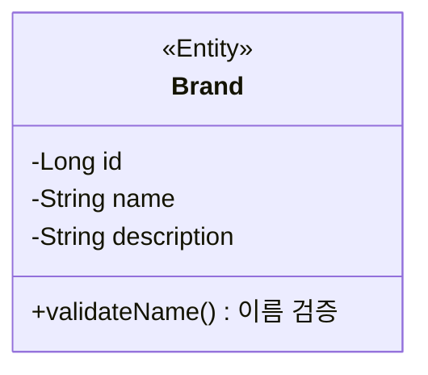
```mermaid
classDiagram
    class Brand {
        <<Entity>>
        -Long id
        -String name
        -String description
        +validateName() 이름 검증
    }
```

**책임**: "브랜드 정보 관리"

| 속성 | 설명 | 예시 |
|---|---|---|
| id | 브랜드 고유 번호 | 1 |
| name | 브랜드명 | "나이키" |
| description | 브랜드 설명 | "스포츠 의류 및 용품" |

**비즈니스 규칙**:
```
✓ 브랜드명은 중복될 수 없음
✓ 브랜드명은 필수
```

---

### 1.2 Product (상품)

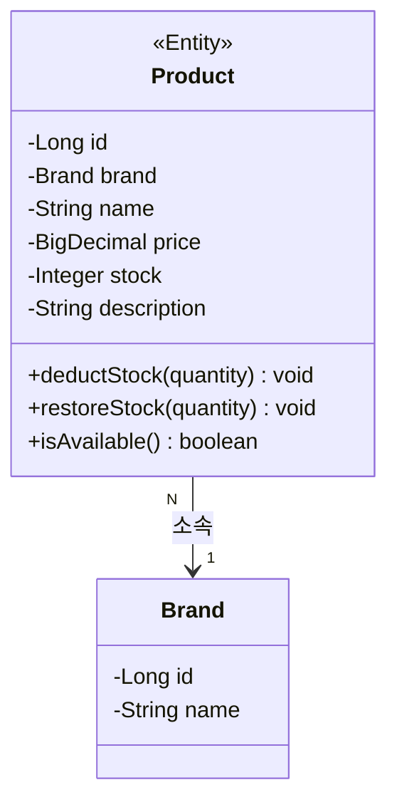
```mermaid
classDiagram
    class Product {
        <<Entity>>
        -Long id
        -Brand brand
        -String name
        -BigDecimal price
        -Integer stock
        -String description
        +deductStock(quantity) void
        +restoreStock(quantity) void
        +isAvailable() boolean
    }

    class Brand {
        -Long id
        -String name
    }

    Product "N" --> "1" Brand : 소속
```

**책임**: "상품 정보와 재고 관리"

#### 주요 메서드

**1. deductStock(quantity) - 재고 차감**

```java
// 나쁜 예 - Service에서 처리
class ProductService {
    public void deductStock(Product product, int quantity) {
        if (product.getStock() < quantity) {
            throw new Exception();
        }
        product.setStock(product.getStock() - quantity);
    }
}

// 좋은 예 - Product가 스스로 처리
class Product {
    public void deductStock(int quantity) {
        if (this.stock < quantity) {
            throw new InsufficientStockException(
                "재고 부족: 필요 " + quantity + "개, 현재 " + this.stock + "개"
            );
        }
        this.stock -= quantity;
    }
}
```

**왜 좋은가?**
- 재고 규칙을 Product가 스스로 지킴
- Service는 "deductStock 해줘"라고만 요청 (TDA 원칙)
- 재고 규칙이 변경되어도 Product만 수정하면 됨

**2. isAvailable() - 판매 가능 여부**

```java
public boolean isAvailable() {
    return this.stock > 0 && this.deletedAt == null;
}
```

**왜 필요한가?**
- 재고가 있고, 삭제되지 않은 상품만 판매 가능
- 이 규칙을 아는 건 Product 자신

#### 비즈니스 규칙

| 규칙 | 설명 | 검증 방법 |
|---|---|---|
| 재고는 음수 불가 | 판매할 수 없는 상품을 의미 | `stock >= 0` |
| 가격은 0원 이상 | 무료는 별도 처리 | `price >= 0` |
| 모든 상품은 브랜드 소속 | 출처 불명 상품 방지 | `brand != null` |

---

## 2. 좋아요 도메인

### 2.1 Like (좋아요)

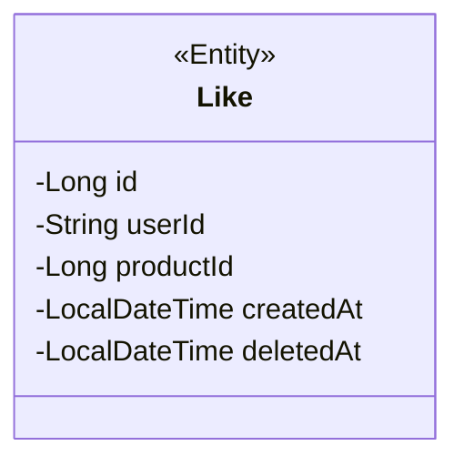
```mermaid
classDiagram
    class Like {
        <<Entity>>
        -Long id
        -String userId
        -Long productId
        -LocalDateTime createdAt
        -LocalDateTime deletedAt
    }
```

**책임**: "누가 어떤 상품을 좋아요했는지 기록"

#### 특별한 점: 멱등성 보장

```
[문제 상황]
고객이 같은 상품에 좋아요를 2번 클릭

[나쁜 설계]
Like 객체가 2개 생성됨
→ 데이터 중복
→ 좋아요 수가 2개로 계산됨

[좋은 설계] - 가장 단순한
DB에 UNIQUE 제약: (userId, productId)
→ 중복 시 기존 데이터 유지
→ 에러 없이 성공 응답
→ 멱등성 보장
```

#### 비즈니스 규칙

| 규칙 | 설명 | 구현 방법 |
|---|---|---|
| 중복 불가 | 한 사용자는 한 상품에 한 번만 | UNIQUE(userId, productId) |
| Soft Delete | 취소 시 실제 삭제 안 함 | deletedAt 기록 |

---

## 3. 주문 도메인

### 3.1 Order (주문)

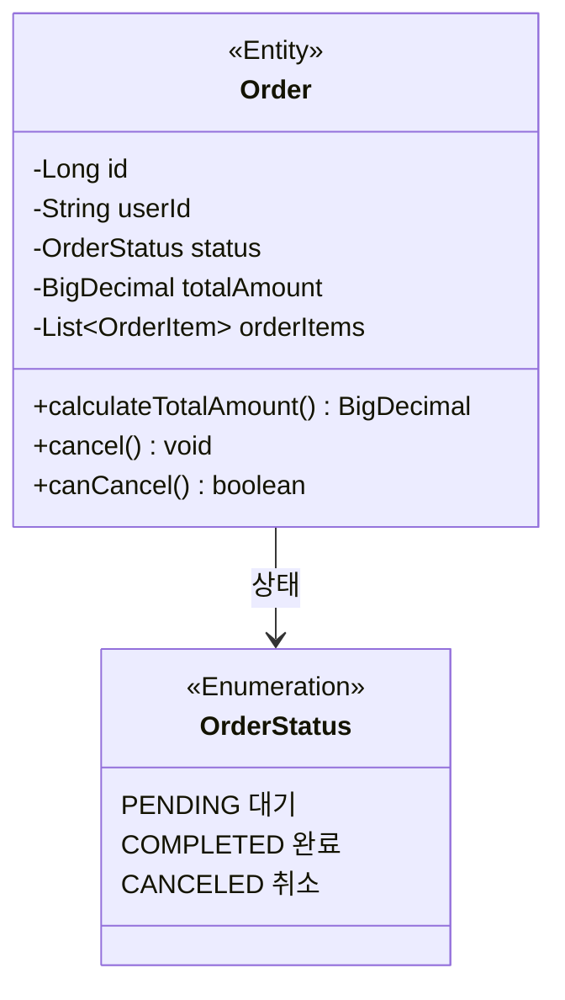
```mermaid
classDiagram
    class Order {
        <<Entity>>
        -Long id
        -String userId
        -OrderStatus status
        -BigDecimal totalAmount
        -List~OrderItem~ orderItems
        +calculateTotalAmount() BigDecimal
        +cancel() void
        +canCancel() boolean
    }

    class OrderStatus {
        <<Enumeration>>
        PENDING 대기
        COMPLETED 완료
        CANCELED 취소
    }

    Order --> OrderStatus : 상태
```

**책임**: "주문 정보 관리, 취소 가능 여부"

#### 주요 메서드

**1. canCancel() - 취소 가능 여부**

```java
public boolean canCancel() {
    // 배송 시작 전에만 취소 가능
    return this.status == OrderStatus.PENDING;
}
```

**왜 Order가 판단하는지**
- 취소 가능 여부는 주문 상태에 따라 결정됨
- 이 규칙을 아는 건 `Order` 자신
- `Service`는 "취소 가능해?"라고만 물어봄

**2. cancel() - 주문 취소**

```java
public void cancel() {
    if (!this.canCancel()) {
        throw new IllegalStateException(
            "배송 시작 후에는 취소할 수 없습니다"
        );
    }
    this.status = OrderStatus.CANCELED;
    this.canceledAt = LocalDateTime.now();
}
```

**책임 분리의 예**
```
OrderFacade (지휘자)
"Order야, 취소 가능해?"
"ProductService야, 재고 복구해줘"
"PointService야, 포인트 환불해줘"
"Order야, 이제 취소해"

Order (실행자):
"내가 판단할게. 응, 취소 가능해"
...
"OK, 취소할게"
```

#### 상태 전이 규칙

```
PENDING (대기)
    ↓ 배송 시작
COMPLETED (완료)

PENDING (대기)
    ↓ 고객 취소
CANCELED (취소)

[불가능한 전이]
COMPLETED → CANCELED  ❌ (배송 시작 후 취소 불가)
CANCELED → PENDING    ❌ (취소 후 재주문 불가)
```

---

### 3.2 OrderItem (주문 항목)

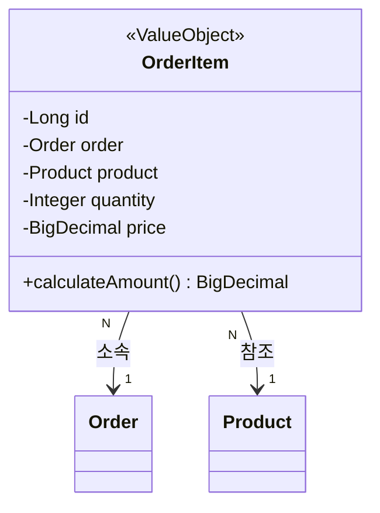
```mermaid
classDiagram
    class OrderItem {
        <<ValueObject>>
        -Long id
        -Order order
        -Product product
        -Integer quantity
        -BigDecimal price
        +calculateAmount() BigDecimal
    }

    OrderItem "N" --> "1" Order : 소속
    OrderItem "N" --> "1" Product : 참조
```

**책임**: "주문 항목의 금액 계산"

#### 중요한 개념: 가격 스냅샷

```
[문제 상황]
1. 2025-11-07: 신발 50,000원에 주문
2. 2025-11-08: 신발 가격이 60,000원으로 인상
3. 주문 내역 조회 시 금액이 60,000원으로 표시됨?
→ 주문 당시 가격이 유지되어야 함

[해결]
OrderItem.price = 주문 당시 상품 가격을 저장 (스냅샷)
이후 Product.price가 변경되어도 주문 금액은 불변
```

**왜 이렇게 하는지**
- 주문 후 상품 가격이 변경되어도 주문 금액은 변하지 않음
- 고객과의 약속을 지킴
- 정산 시 금액 불일치 방지

#### 주요 메서드

```java
public BigDecimal calculateAmount() {
    // price: 주문 당시 가격 (스냅샷)
    // quantity: 주문 수량
    return this.price.multiply(BigDecimal.valueOf(this.quantity));
}
```

---

## 4. 사용자/포인트 도메인

### 4.1 Point (포인트)

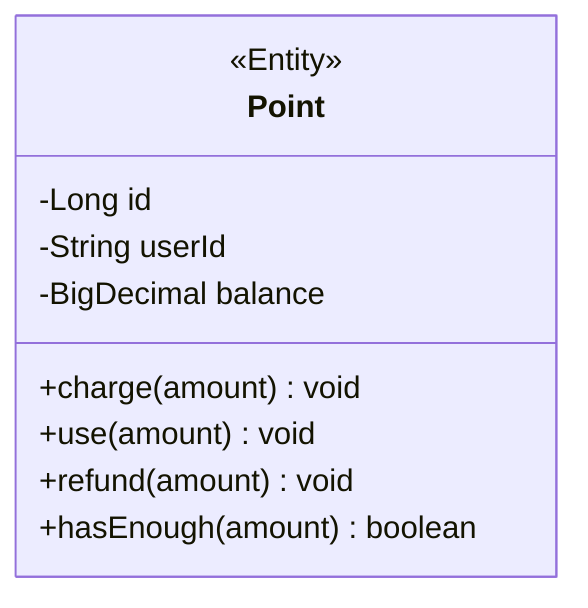
```mermaid
classDiagram
    class Point {
        <<Entity>>
        -Long id
        -String userId
        -BigDecimal balance
        +charge(amount) void
        +use(amount) void
        +refund(amount) void
        +hasEnough(amount) boolean
    }
```

**책임**: "포인트 잔액 관리, 부족 여부 체크"

#### 주요 메서드

**1. use(amount) - 포인트 사용**

```java
public void use(BigDecimal amount) {
    if (this.balance.compareTo(amount) < 0) {
        throw new InsufficientPointException(
            "포인트 부족: 필요 " + amount + "원, 보유 " + this.balance + "원"
        );
    }
    this.balance = this.balance.subtract(amount);
}
```

**왜 Point가 검증하나?**
- 잔액 부족 여부는 Point가 제일 잘 앎
- Service는 "use 해줘"라고만 요청
- 검증 실패 시 Point가 예외를 던짐

---

### 4.2 PointHistory (포인트 거래 내역)

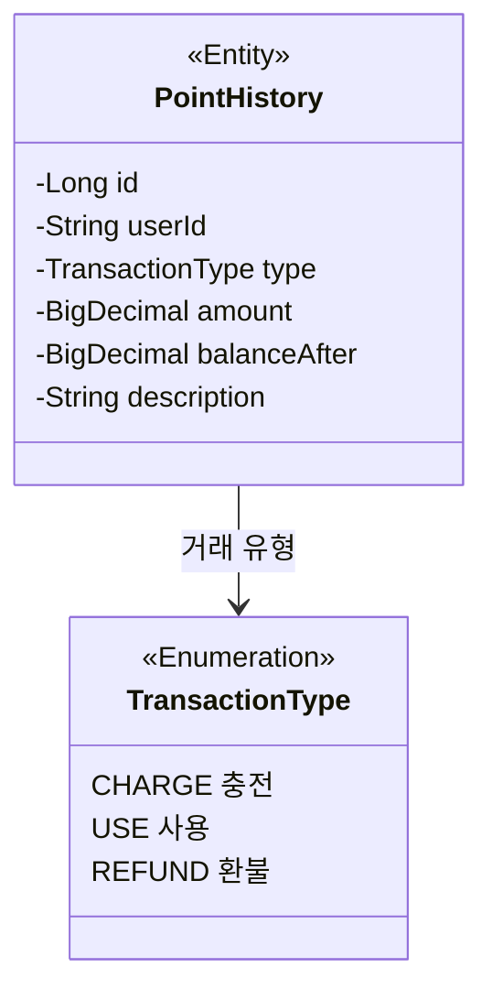
```mermaid
classDiagram
    class PointHistory {
        <<Entity>>
        -Long id
        -String userId
        -TransactionType type
        -BigDecimal amount
        -BigDecimal balanceAfter
        -String description
    }

    class TransactionType {
        <<Enumeration>>
        CHARGE 충전
        USE 사용
        REFUND 환불
    }

    PointHistory --> TransactionType : 거래 유형
```

**책임**: "포인트 거래 기록 및 보관해 (수정 불가)"

#### 특별한 점: 불변 객체 (Immutable)

```
[원칙]
PointHistory는 한 번 생성되면 절대 수정 안 됨

[이유]
- 감사 추적(Audit Trail) 용도
- 고객과의 분쟁 시 증거 자료
- 금융 거래의 특성상 변경 불가

[구현]
- setter 메서드 없음
- 생성자로만 초기화
- 모든 필드 final
```

**balanceAfter 필드의 중요성**
```
거래 내역:
1. 충전 +10,000원 (잔액 후: 10,000원)
2. 사용 -3,000원  (잔액 후: 7,000원)
3. 사용 -2,000원  (잔액 후: 5,000원)

만약 balanceAfter가 없다면?
→ 현재 잔액과 거래 내역이 일치하는지 검증 불가

balanceAfter가 있으면?
→ 각 거래 시점의 잔액을 알 수 있음
→ 데이터 정합성 검증 가능
```

---

## 📊 설계 원칙 정리

### 1. Tell, Don't Ask (묻지 말고 시켜라)

```
[나쁜 예 - Ask]
if (product.getStock() < quantity) {  // 묻기
    throw new Exception();
}
product.setStock(product.getStock() - quantity);  // 직접 변경

[좋은 예 - Tell]
product.deductStock(quantity);  // 시키기
→ Product가 알아서 검증하고 처리
```

### 2. 정보 전문가 (Information Expert)

```
"그 정보를 가진 객체가 그 정보에 대한 로직도 가져야 한다"

✓ 재고 정보를 가진 Product → 재고 차감 로직도 Product에
✓ 포인트 잔액을 가진 Point → 포인트 사용 로직도 Point에
✓ 주문 상태를 가진 Order → 취소 가능 여부 판단도 Order에
```

### 3. 단일 책임 원칙 (SRP)

```
한 클래스는 한 가지 이유로만 변경되어야 한다

Product:
✓ 상품 정보가 변경되면 수정
✗ 주문 로직이 변경되어도 수정 안 함

Order:
✓ 주문 규칙이 변경되면 수정
✗ 포인트 규칙이 변경되어도 수정 안 함
```

### 4. 값 객체 (Value Object)

```
OrderItem은 "값 객체"

특징:
- Order에 종속됨 (독립적으로 존재 불가)
- Order가 삭제되면 함께 삭제됨
- 주문 항목끼리 비교할 일 없음 (ID보다는 값으로 구분)
```

---

## 🔗 객체 간 협력 예시

### 주문 생성 시 객체 협력

```
OrderFacade: "주문 생성 시작!"

1. ProductService에게:
   "Product야, 재고 충분해?"
   Product: "내가 확인할게. 충분해!"
   "그럼 재고 차감해줘"
   Product: "OK, 차감했어"

2. PointService에게:
   "Point야, 포인트 충분해?"
   Point: "내가 확인할게. 충분해!"
   "그럼 포인트 사용해줘"
   Point: "OK, 사용했어"

3. OrderService에게:
   "이제 주문 생성해줘"
   Order: "OK, 주문 생성했어"

→ 각 객체가 자신의 책임을 다함
→ Facade는 흐름만 조율
```

---

## 7. 쿠폰 도메인 (Round 4 추가)

### 7.1 Coupon (쿠폰 마스터)

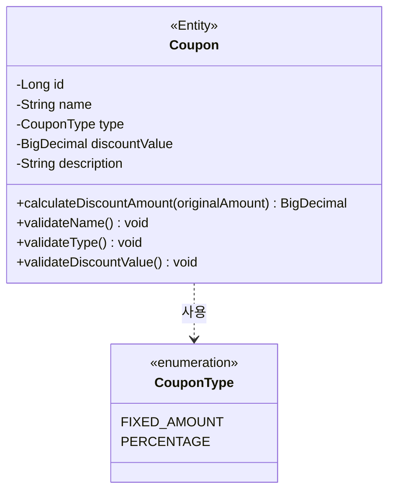
```mermaid
classDiagram
    class Coupon {
        <<Entity>>
        -Long id
        -String name
        -CouponType type
        -BigDecimal discountValue
        -String description
        +calculateDiscountAmount(originalAmount) BigDecimal
        +validateName() void
        +validateType() void
        +validateDiscountValue() void
    }

    class CouponType {
        <<enumeration>>
        FIXED_AMOUNT
        PERCENTAGE
    }

    Coupon ..> CouponType : 사용
```

**책임**: "쿠폰 마스터 정보 관리 및 할인 금액 계산"

| 속성 | 설명 | 예시 |
|---|---|---|
| id | 쿠폰 고유 번호 | 1 |
| name | 쿠폰명 | "신규 가입 쿠폰" |
| type | 쿠폰 타입 | FIXED_AMOUNT (정액) or PERCENTAGE (정률) |
| discountValue | 할인 값 | 5000 (정액 5000원) 또는 10 (정률 10%) |
| description | 쿠폰 설명 | "신규 가입 시 5000원 할인" |

**비즈니스 규칙**:
```
✓ 쿠폰명은 필수
✓ 쿠폰 타입은 필수 (FIXED_AMOUNT, PERCENTAGE 중 하나)
✓ 할인 값은 0보다 커야 함
✓ 정률 쿠폰의 경우 할인 값은 100% 이하여야 함
✓ 정액 쿠폰: 할인 금액이 원래 금액보다 크면 원래 금액을 반환
✓ 정률 쿠폰: (원래 금액 * 할인율 / 100), 소수점 버림
```

**주요 메서드**:
- `calculateDiscountAmount(BigDecimal originalAmount)`: 원래 금액에 대한 할인 금액 계산
  - FIXED_AMOUNT: min(discountValue, originalAmount)
  - PERCENTAGE: floor(originalAmount * discountValue / 100)

---

### 7.2 UserCoupon (사용자별 발급 쿠폰)

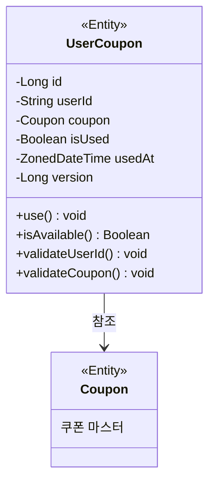
```mermaid
classDiagram
    class UserCoupon {
        <<Entity>>
        -Long id
        -String userId
        -Coupon coupon
        -Boolean isUsed
        -ZonedDateTime usedAt
        -Long version
        +use() void
        +isAvailable() Boolean
        +validateUserId() void
        +validateCoupon() void
    }

    class Coupon {
        <<Entity>>
        쿠폰 마스터
    }

    UserCoupon --> Coupon : 참조
```

**책임**: "사용자별 쿠폰 발급 및 사용 관리"

| 속성 | 설명 | 예시 |
|---|---|---|
| id | 발급 쿠폰 고유 번호 | 1 |
| userId | 사용자 ID | "user123" |
| coupon | 쿠폰 마스터 정보 | Coupon 참조 |
| isUsed | 사용 여부 | false |
| usedAt | 사용 시간 | 2025-11-18T10:30:00Z |
| version | 낙관적 락 버전 | 0 |

**비즈니스 규칙**:
```
✓ 사용자 ID는 필수
✓ 쿠폰 마스터 정보는 필수
✓ 각 쿠폰은 최대 1회만 사용 가능 (isUsed = true 이후 재사용 불가)
✓ 삭제된 쿠폰은 사용 불가
✓ Version 필드를 통한 낙관적 락 적용 (동시성 제어)
```

**주요 메서드**:
- `use()`: 쿠폰 사용 처리
  - 이미 사용된 쿠폰이면 예외 발생
  - 삭제된 쿠폰이면 예외 발생
  - isUsed = true, usedAt = 현재 시간 설정
- `isAvailable()`: 사용 가능 여부 확인
  - !isUsed && deletedAt == null

---

### 7.3 동시성 제어

**낙관적 락 (@Version)**:
```java
@Version
@Column(nullable = false)
private Long version;
```
- 여러 트랜잭션이 동시에 같은 UserCoupon을 사용하려 할 때
- Version 필드로 충돌 감지
- 먼저 커밋된 트랜잭션만 성공, 나머지는 OptimisticLockException 발생

**비관적 락 (@Lock PESSIMISTIC_WRITE)**:
```java
@Lock(LockModeType.PESSIMISTIC_WRITE)
@Query("SELECT uc FROM UserCoupon uc WHERE uc.id = :id")
Optional<UserCoupon> findByIdWithLock(@Param("id") Long id);
```
- 주문 생성 시 UserCoupon 조회 시 사용
- SELECT ... FOR UPDATE로 락 획득
- 트랜잭션 종료 시까지 다른 트랜잭션 차단

---

## 8. 주문 플로우 업데이트 (쿠폰 적용)

### 8.1 OrderFacade 흐름

```
주문 생성 플로우 (with Coupon):

1. [쿠폰 검증 및 사용]
   └─ UserCoupon 조회 (비관적 락)
   └─ 쿠폰 소유자 확인
   └─ 쿠폰 사용 가능 여부 확인
   └─ 쿠폰 사용 처리 (use())

2. [상품 재고 확인 및 차감]
   └─ Product 조회 (비관적 락)
   └─ 재고 검증 및 차감 (deductStock())

3. [주문 생성]
   └─ Order 엔티티 생성
   └─ OrderItem 추가 (스냅샷 패턴)
   └─ 총 금액 계산

4. [쿠폰 할인 적용]
   └─ Coupon.calculateDiscountAmount() 호출
   └─ 최종 결제 금액 = 총 금액 - 할인 금액
   └─ (할인 후 금액이 0보다 작으면 0으로 설정)

5. [포인트 차감]
   └─ Point 조회 (비관적 락)
   └─ 포인트 사용 (use())

6. [주문 저장]
   └─ Order 저장
```

**동시성 제어 전략**:
- Product 재고: 비관적 락 (PESSIMISTIC_WRITE)
- Point 잔액: 비관적 락 (PESSIMISTIC_WRITE)
- UserCoupon 사용: 비관적 락 + Version (낙관적 락)
- 트랜잭션 범위: OrderFacade.createOrder() 전체

**실패 시 롤백**:
- 쿠폰 불가 → 전체 롤백
- 재고 부족 → 전체 롤백 (쿠폰 사용도 롤백)
- 포인트 부족 → 전체 롤백 (쿠폰 사용 + 재고 차감 모두 롤백)

---

## 요약

### 추가된 도메인

1. **Coupon**: 쿠폰 마스터 (정액/정률 할인 로직)
2. **UserCoupon**: 사용자별 발급 쿠폰 (사용 여부 관리, 동시성 제어)
3. **CouponType**: 쿠폰 타입 Enum

### 동시성 제어

- **낙관적 락**: UserCoupon, Product, Point에 @Version 추가
- **비관적 락**: 주문 생성 시 UserCoupon, Product, Point 조회에 @Lock 사용
- **트랜잭션**: OrderFacade 전체에 @Transactional 적용

### 주문 플로우 변경

- 기존: 상품 → 포인트 → 주문
- 변경: **쿠폰** → 상품 → **쿠폰 할인** → 포인트 → 주문

---

## 8. 랭킹 도메인 (Round 10 추가)

### 8.1 WeeklyProductRank (주간 상품 랭킹)

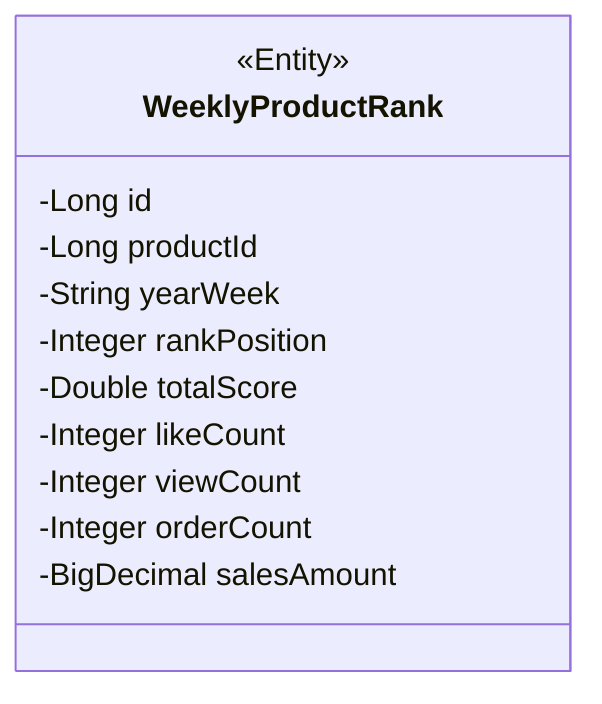
```mermaid
classDiagram
    class WeeklyProductRank {
        <<Entity>>
        -Long id
        -Long productId
        -String yearWeek
        -Integer rankPosition
        -Double totalScore
        -Integer likeCount
        -Integer viewCount
        -Integer orderCount
        -BigDecimal salesAmount
    }
```

**책임**: "주간 상품 랭킹 데이터 저장"

| 속성 | 설명 | 예시 |
|---|---|---|
| id | 랭킹 고유 번호 | 1 |
| productId | 상품 ID | 123 |
| yearWeek | ISO Week 형식 | "2025-W05" |
| rankPosition | 순위 (1~100) | 1 |
| totalScore | 총점 | 125.5 |
| likeCount | 좋아요 수 | 100 |
| viewCount | 조회 수 | 1000 |
| orderCount | 주문 수 | 50 |
| salesAmount | 판매 금액 | 5000000.00 |

**비즈니스 규칙**:
```
✓ Spring Batch로 주 1회 집계 (매주 월요일 01:00)
✓ TOP 100만 저장
✓ 점수 계산: (view_count × 0.1) + (like_count × 0.2) + (order_count × 0.6 × log10(sales_amount + 1))
✓ Read-Only 데이터 (조회 전용)
```

**특징**:
- Materialized View 패턴 적용
- 조회 성능 최적화를 위한 사전 집계 데이터
- Batch Job을 통해 주기적으로 갱신

---

### 8.2 MonthlyProductRank (월간 상품 랭킹)

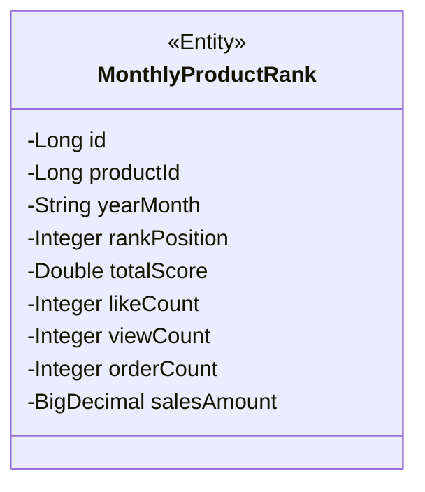
```mermaid
classDiagram
    class MonthlyProductRank {
        <<Entity>>
        -Long id
        -Long productId
        -String yearMonth
        -Integer rankPosition
        -Double totalScore
        -Integer likeCount
        -Integer viewCount
        -Integer orderCount
        -BigDecimal salesAmount
    }
```

**책임**: "월간 상품 랭킹 데이터 저장"

| 속성 | 설명 | 예시 |
|---|---|---|
| id | 랭킹 고유 번호 | 1 |
| productId | 상품 ID | 123 |
| yearMonth | 년월 형식 | "2025-01" |
| rankPosition | 순위 (1~100) | 1 |
| totalScore | 총점 | 850.3 |
| likeCount | 좋아요 수 | 400 |
| viewCount | 조회 수 | 5000 |
| orderCount | 주문 수 | 200 |
| salesAmount | 판매 금액 | 20000000.00 |

**비즈니스 규칙**:
```
✓ Spring Batch로 월 1회 집계 (매월 1일 02:00)
✓ TOP 100만 저장
✓ 점수 계산: 주간 랭킹과 동일
✓ Read-Only 데이터 (조회 전용)
```

---

### 8.3 Ranking API 설계

**RankingFacade의 역할**:
```
RankingFacade:
"랭킹 데이터를 Product 정보와 함께 제공"

1. Daily Ranking (기존)
   → product_metrics 테이블 조회
   → Product 정보와 결합

2. Weekly Ranking (NEW)
   → mv_product_rank_weekly 테이블 조회
   → Product 정보와 결합

3. Monthly Ranking (NEW)
   → mv_product_rank_monthly 테이블 조회
   → Product 정보와 결합
```

**왜 Facade를 사용하나?**
- 랭킹 데이터만으로는 불충분 (상품명, 브랜드명 필요)
- RankingService는 랭킹 조회만 담당
- ProductService는 상품 정보 조회만 담당
- RankingFacade가 둘을 결합

**조회 성능 최적화**:
```
[나쁜 예]
매번 product_metrics 전체 집계
→ 느림 (SUM, GROUP BY)

[좋은 예 - Materialized View]
미리 계산된 랭킹 조회
→ 빠름 (단순 SELECT)
```

---

##  10. 결제 도메인 (Round 6 추가)

### 10.1 Payment (결제)

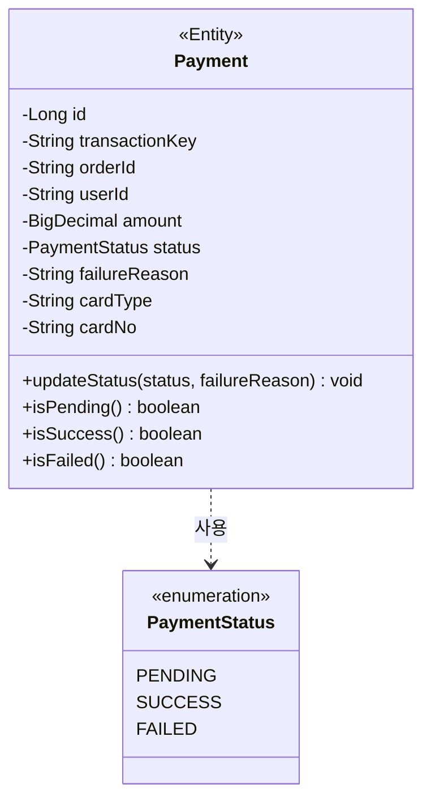
```mermaid
classDiagram
    class Payment {
        <<Entity>>
        -Long id
        -String transactionKey
        -String orderId
        -String userId
        -BigDecimal amount
        -PaymentStatus status
        -String failureReason
        -String cardType
        -String cardNo
        +updateStatus(status, failureReason) void
        +isPending() boolean
        +isSuccess() boolean
        +isFailed() boolean
    }

    class PaymentStatus {
        <<enumeration>>
        PENDING
        SUCCESS
        FAILED
    }

    Payment ..> PaymentStatus : 사용
```

**책임**: "결제 상태 관리 및 결제 정보 보관"

| 속성 | 설명 | 예시 |
|---|---|---|
| id | 결제 고유 번호 | 1 |
| transactionKey | PG사 거래 키 (unique) | "TXN20250130123456" |
| orderId | 주문 ID | "123" |
| userId | 사용자 ID | "user123" |
| amount | 결제 금액 | 50000.00 |
| status | 결제 상태 | PENDING |
| failureReason | 실패 사유 | "카드 한도 초과" |
| cardType | 카드 타입 | "CREDIT" |
| cardNo | 카드 번호 (마스킹) | "1234-****-****-5678" |

**비즈니스 규칙**:
```
✓ transactionKey는 중복 불가 (PG사 거래 고유 식별자)
✓ 결제 상태는 PENDING → SUCCESS 또는 FAILED로만 변경 가능
✓ SUCCESS 또는 FAILED는 최종 상태 (더 이상 변경 불가)
✓ 결제 실패 시 failureReason 필수
```

**주요 메서드**:
- `updateStatus(status, failureReason)`: 결제 상태 업데이트
  - PENDING에서만 SUCCESS 또는 FAILED로 변경 가능
  - FAILED로 변경 시 failureReason 필수
- `isPending()`, `isSuccess()`, `isFailed()`: 상태 확인 편의 메서드

**결제 프로세스**:
```
1. 주문 생성 → Payment 생성 (status=PENDING)
2. PG사 연동 → 결제 요청
3. PG사 콜백:
   - 성공 → updateStatus(SUCCESS, null)
   - 실패 → updateStatus(FAILED, "실패 사유")
4. PaymentSuccessEvent 또는 PaymentFailedEvent 발행
```

---

### 10.2 PaymentStatus (결제 상태)

| 상태 | 의미 | 다음 가능 상태 |
|---|---|---|
| PENDING | 결제 요청됨, PG사 응답 대기 중 | SUCCESS, FAILED |
| SUCCESS | 결제 성공 | 없음 (최종 상태) |
| FAILED | 결제 실패 | 없음 (최종 상태) |

---

## 11. 이벤트 도메인 (Round 8 추가)

### 11.1 EventOutbox (이벤트 아웃박스)

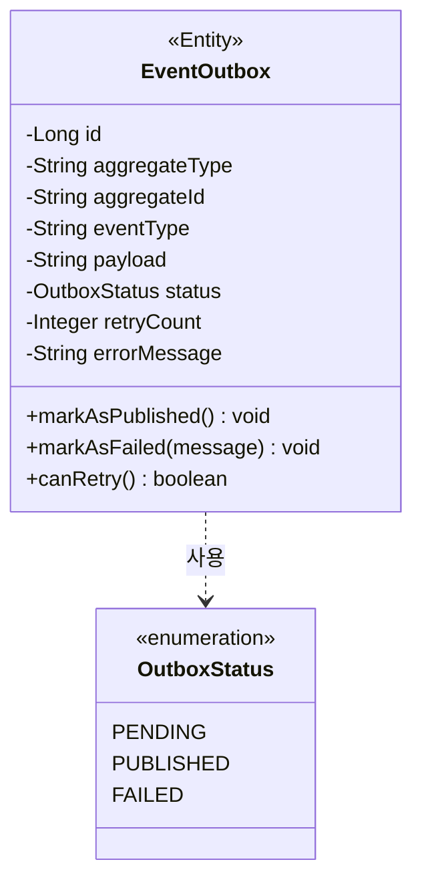
```mermaid
classDiagram
    class EventOutbox {
        <<Entity>>
        -Long id
        -String aggregateType
        -String aggregateId
        -String eventType
        -String payload
        -OutboxStatus status
        -Integer retryCount
        -String errorMessage
        +markAsPublished() void
        +markAsFailed(message) void
        +canRetry() boolean
    }

    class OutboxStatus {
        <<enumeration>>
        PENDING
        PUBLISHED
        FAILED
    }

    EventOutbox ..> OutboxStatus : 사용
```

**책임**: "Transactional Outbox 패턴 구현을 통한 이벤트 발행 보장"

| 속성 | 설명 | 예시 |
|---|---|---|
| id | 아웃박스 고유 번호 | 1 |
| aggregateType | 애그리거트 타입 | "ORDER", "PAYMENT", "LIKE" |
| aggregateId | 애그리거트 ID | "123" |
| eventType | 이벤트 타입 | "OrderCreatedEvent" |
| payload | 이벤트 페이로드 (JSON) | "{\"orderId\":123,\"userId\":\"user1\"}" |
| status | 발행 상태 | PENDING |
| retryCount | 재시도 횟수 | 0 |
| errorMessage | 에러 메시지 | "Kafka broker not available" |

**비즈니스 규칙**:
```
✓ 비즈니스 트랜잭션과 동일한 트랜잭션에서 이벤트 저장
✓ 최대 재시도 횟수는 3회
✓ 3회 실패 시 status = FAILED (수동 처리 필요)
✓ PUBLISHED 상태는 최종 상태
```

**Transactional Outbox 패턴**:
```
[문제]
주문 생성 후 이벤트 발행 시 네트워크 장애로 실패하면?
→ 주문은 생성되었지만 이벤트는 발행 안 됨
→ 데이터 불일치

[해결]
1. 주문 생성과 동시에 EventOutbox에 이벤트 저장 (같은 트랜잭션)
2. 별도 스케줄러가 PENDING 이벤트를 Kafka로 발행
3. 발행 성공 → PUBLISHED
4. 발행 실패 → 재시도 (최대 3회)
5. 3회 실패 → FAILED (수동 처리)

[장점]
✓ At-least-once 전송 보장 (이벤트 손실 방지)
✓ 트랜잭션 일관성 (주문 생성 실패 → 이벤트도 저장 안 됨)
```

**주요 메서드**:
- `markAsPublished()`: 발행 성공 처리
- `markAsFailed(errorMessage)`: 발행 실패 처리 및 재시도 횟수 증가
- `canRetry()`: 재시도 가능 여부 확인 (retryCount < 3)

---

### 11.2 OutboxStatus (아웃박스 상태)

| 상태 | 의미 | 다음 가능 상태 |
|---|---|---|
| PENDING | 발행 대기 중 | PUBLISHED, FAILED |
| PUBLISHED | 발행 완료 | 없음 (최종 상태) |
| FAILED | 발행 실패 (3회 초과) | 없음 (수동 처리 필요) |

---

## 12. 메트릭 도메인 (Round 9 추가)

### 12.1 ProductMetrics (상품 메트릭)

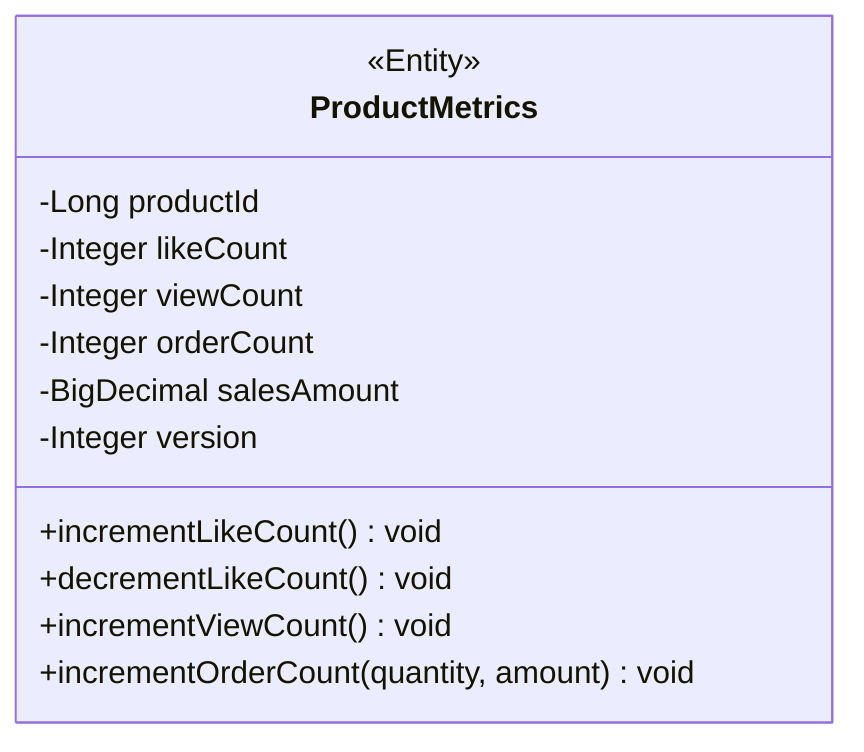
```mermaid
classDiagram
    class ProductMetrics {
        <<Entity>>
        -Long productId
        -Integer likeCount
        -Integer viewCount
        -Integer orderCount
        -BigDecimal salesAmount
        -Integer version
        +incrementLikeCount() void
        +decrementLikeCount() void
        +incrementViewCount() void
        +incrementOrderCount(quantity, amount) void
    }
```

**책임**: "상품별 실시간 메트릭 집계"

| 속성 | 설명 | 예시 |
|---|---|---|
| productId | 상품 ID (PK) | 123 |
| likeCount | 좋아요 수 | 100 |
| viewCount | 조회 수 | 1000 |
| orderCount | 주문 수 | 50 |
| salesAmount | 판매 금액 | 5000000.00 |
| version | 낙관적 락 버전 | 0 |

**비즈니스 규칙**:
```
✓ Kafka 이벤트를 통해 실시간 집계
✓ 이벤트 타입별 처리:
  - LikeCreatedEvent → incrementLikeCount()
  - LikeDeletedEvent → decrementLikeCount()
  - ProductViewedEvent → incrementViewCount()
  - OrderCreatedEvent → incrementOrderCount()
✓ 낙관적 락을 통한 동시성 제어
```

**이벤트 기반 집계**:
```
[commerce-streamer 역할]
1. Kafka Consumer가 이벤트 수신
2. ProductMetrics 조회 (없으면 생성)
3. 이벤트 타입별 메트릭 증가
4. DB 저장

[예시]
ProductViewedEvent 수신 → productMetrics.incrementViewCount()
LikeCreatedEvent 수신 → productMetrics.incrementLikeCount()
OrderCreatedEvent 수신 → productMetrics.incrementOrderCount(quantity, amount)
```

**주요 메서드**:
- `incrementLikeCount()`: 좋아요 수 +1
- `decrementLikeCount()`: 좋아요 수 -1
- `incrementViewCount()`: 조회 수 +1
- `incrementOrderCount(quantity, amount)`: 주문 수 +quantity, 판매 금액 +amount

---

## 13. Spring Batch 아키텍처 (Round 10 추가)

### 9.1 Batch Job 구성

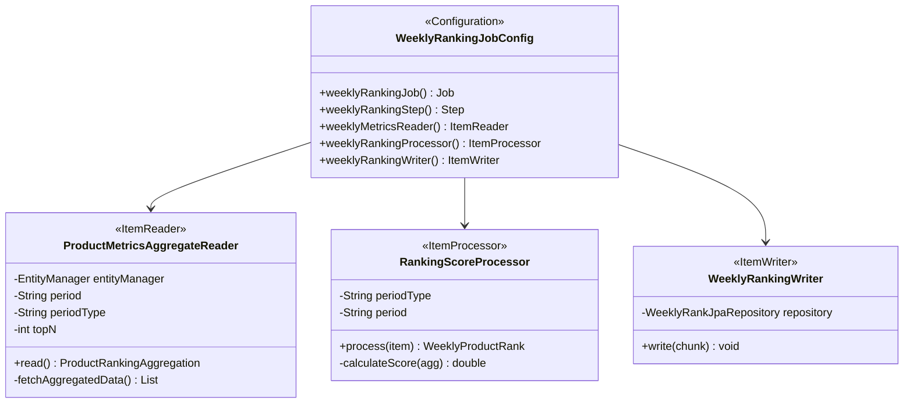
```mermaid
classDiagram
    class WeeklyRankingJobConfig {
        <<Configuration>>
        +weeklyRankingJob() Job
        +weeklyRankingStep() Step
        +weeklyMetricsReader() ItemReader
        +weeklyRankingProcessor() ItemProcessor
        +weeklyRankingWriter() ItemWriter
    }

    class ProductMetricsAggregateReader {
        <<ItemReader>>
        -EntityManager entityManager
        -String period
        -String periodType
        -int topN
        +read() ProductRankingAggregation
        -fetchAggregatedData() List
    }

    class RankingScoreProcessor {
        <<ItemProcessor>>
        -String periodType
        -String period
        +process(item) WeeklyProductRank
        -calculateScore(agg) double
    }

    class WeeklyRankingWriter {
        <<ItemWriter>>
        -WeeklyRankJpaRepository repository
        +write(chunk) void
    }

    WeeklyRankingJobConfig --> ProductMetricsAggregateReader
    WeeklyRankingJobConfig --> RankingScoreProcessor
    WeeklyRankingJobConfig --> WeeklyRankingWriter
```

**Chunk-Oriented Processing**:
```
Step 실행:
1. Reader: product_metrics에서 100개 읽기
2. Processor: 점수 계산 및 순위 매기기
3. Writer: mv_product_rank_weekly에 저장
4. Transaction Commit
5. 다음 Chunk로 반복
```

**책임 분리**:
- **Reader**: 데이터 읽기 (product_metrics 집계)
- **Processor**: 비즈니스 로직 (점수 계산)
- **Writer**: 데이터 쓰기 (Materialized View 저장)

---

## 요약

### Round 10에서 추가된 도메인

1. **WeeklyProductRank**: 주간 상품 랭킹 (Materialized View)
2. **MonthlyProductRank**: 월간 상품 랭킹 (Materialized View)
3. **Spring Batch 컴포넌트**: Reader, Processor, Writer

### 설계 패턴

- **Materialized View Pattern**: 조회 성능 최적화를 위한 사전 집계
- **Chunk-Oriented Processing**: Batch 처리의 효율성과 트랜잭션 관리
- **Facade Pattern**: 랭킹과 상품 정보를 결합하여 제공

### 배치 처리 흐름

```
매주 월요일 01:00 (주간 랭킹):
1. product_metrics 집계
2. 점수 계산 및 순위 매기기
3. TOP 100 선정
4. mv_product_rank_weekly 저장

매월 1일 02:00 (월간 랭킹):
1. product_metrics 집계
2. 점수 계산 및 순위 매기기
3. TOP 100 선정
4. mv_product_rank_monthly 저장
```
