# 클래스 다이어그램 (Class Diagram)

> 각 객체가 **어떤 책임**을 가지고, **어떻게 협력**하는지를 시각화한 문서입니다.

---

## 🎯 도메인 객체 vs 데이터 저장소

### 도메인 객체는 "똑똑한 객체"

```
[나쁜 예 - 빈혈 모델 (Anemic Domain Model)]
class Product {
    private String name;
    private int price;
    private int stock;
    // getter, setter만 있음
}

class ProductService {
    // 모든 로직이 여기에!
    public void deductStock(Product product, int quantity) {
        if (product.getStock() < quantity) {
            throw new Exception("재고 부족");
        }
        product.setStock(product.getStock() - quantity);
    }
}

→ Product는 그냥 데이터 주머니
→ 비즈니스 규칙이 Service에 집중


[좋은 예 - 풍부한 도메인 모델 (Rich Domain Model)]
class Product {
    private String name;
    private int price;
    private int stock;
    
    // 자기 자신의 규칙은 스스로
    public void deductStock(int quantity) {
        if (this.stock < quantity) {
            throw new InsufficientStockException();
        }
        this.stock -= quantity;
    }
    
    public boolean isAvailable() {
        return this.stock > 0;
    }
}

→ Product가 자신의 규칙을 알고 있음
→ Service는 Product를 조율하기만 함
```

**핵심 원칙**: "데이터를 가진 객체가 그 데이터에 대한 로직도 가져야 한다"

---

## 🏗️ 전체 도메인 구조

```mermaid
classDiagram
    class User {
        +String userId
        +Gender gender
        +String birthdate
        +String email
        회원 정보 관리
    }

    class Point {
        +String userId
        +BigDecimal balance
        +charge(amount) 충전
        +use(amount) 사용
        +refund(amount) 환불
    }

    class PointHistory {
        +String userId
        +TransactionType type
        +BigDecimal amount
        +BigDecimal balanceAfter
        거래 내역 기록
    }

    class Brand {
        +String name
        +String description
        브랜드 정보
    }

    class Product {
        +Brand brand
        +String name
        +BigDecimal price
        +Integer stock
        +deductStock(quantity) 재고 차감
        +restoreStock(quantity) 재고 복구
        +isAvailable() 판매 가능 여부
    }

    class Like {
        +String userId
        +Long productId
        좋아요 정보
    }

    class Order {
        +String userId
        +OrderStatus status
        +BigDecimal totalAmount
        +List~OrderItem~ items
        +cancel() 주문 취소
        +canCancel() 취소 가능 여부
    }

    class OrderItem {
        +Long productId
        +String productName
        +String brandName
        +Integer quantity
        +BigDecimal price
        +calculateAmount() 금액 계산
        스냅샷 패턴
    }

    class Coupon {
        +String name
        +CouponType type
        +BigDecimal discountValue
        +calculateDiscountAmount(amount) 할인 금액 계산
        쿠폰 마스터
    }

    class UserCoupon {
        +String userId
        +Coupon coupon
        +Boolean isUsed
        +ZonedDateTime usedAt
        +Long version
        +use() 쿠폰 사용
        +isAvailable() 사용 가능 여부
        사용자별 발급 쿠폰
    }

    class CouponType {
        <<enumeration>>
        FIXED_AMOUNT 정액 할인
        PERCENTAGE 정률 할인
    }

    User "1" --> "1" Point : 포인트 계좌
    Point "1" --> "*" PointHistory : 거래 내역
    Brand "1" --> "*" Product : 소속 상품
    User "1" --> "*" Like : 좋아요
    Product "1" --> "*" Like : 좋아요 받음
    User "1" --> "*" Order : 주문
    Order "1" --> "*" OrderItem : 주문 항목
    User "1" --> "*" UserCoupon : 보유 쿠폰
    Coupon "1" --> "*" UserCoupon : 발급됨
    UserCoupon ..> CouponType : 사용
```



## 📦 도메인별 상세 설계

---

## 1. 상품 도메인

### 1.1 Brand (브랜드)

```mermaid
classDiagram
    class Brand {
        <<Entity>>
        -Long id
        -String name
        -String description
        +validateName() 이름 검증
    }
```



**책임**: "브랜드 정보 관리"

| 속성 | 설명 | 예시 |
|---|---|---|
| id | 브랜드 고유 번호 | 1 |
| name | 브랜드명 | "나이키" |
| description | 브랜드 설명 | "스포츠 의류 및 용품" |

**비즈니스 규칙**:
```
✓ 브랜드명은 중복될 수 없음
✓ 브랜드명은 필수
```

---

### 1.2 Product (상품)

```mermaid
classDiagram
    class Product {
        <<Entity>>
        -Long id
        -Brand brand
        -String name
        -BigDecimal price
        -Integer stock
        -String description
        +deductStock(quantity) void
        +restoreStock(quantity) void
        +isAvailable() boolean
    }

    class Brand {
        -Long id
        -String name
    }

    Product "N" --> "1" Brand : 소속
```



**책임**: "상품 정보와 재고 관리"

#### 주요 메서드

**1. deductStock(quantity) - 재고 차감**

```java
// 나쁜 예 - Service에서 처리
class ProductService {
    public void deductStock(Product product, int quantity) {
        if (product.getStock() < quantity) {
            throw new Exception();
        }
        product.setStock(product.getStock() - quantity);
    }
}

// 좋은 예 - Product가 스스로 처리
class Product {
    public void deductStock(int quantity) {
        if (this.stock < quantity) {
            throw new InsufficientStockException(
                "재고 부족: 필요 " + quantity + "개, 현재 " + this.stock + "개"
            );
        }
        this.stock -= quantity;
    }
}
```

**왜 좋은가?**
- 재고 규칙을 Product가 스스로 지킴
- Service는 "deductStock 해줘"라고만 요청 (TDA 원칙)
- 재고 규칙이 변경되어도 Product만 수정하면 됨

**2. isAvailable() - 판매 가능 여부**

```java
public boolean isAvailable() {
    return this.stock > 0 && this.deletedAt == null;
}
```

**왜 필요한가?**
- 재고가 있고, 삭제되지 않은 상품만 판매 가능
- 이 규칙을 아는 건 Product 자신

#### 비즈니스 규칙

| 규칙 | 설명 | 검증 방법 |
|---|---|---|
| 재고는 음수 불가 | 판매할 수 없는 상품을 의미 | `stock >= 0` |
| 가격은 0원 이상 | 무료는 별도 처리 | `price >= 0` |
| 모든 상품은 브랜드 소속 | 출처 불명 상품 방지 | `brand != null` |

---

## 2. 좋아요 도메인

### 2.1 Like (좋아요)


**책임**: "누가 어떤 상품을 좋아요했는지 기록"

#### 특별한 점: 멱등성 보장

```
[문제 상황]
고객이 같은 상품에 좋아요를 2번 클릭

[나쁜 설계]
Like 객체가 2개 생성됨
→ 데이터 중복
→ 좋아요 수가 2개로 계산됨

[좋은 설계] - 가장 단순한
DB에 UNIQUE 제약: (userId, productId)
→ 중복 시 기존 데이터 유지
→ 에러 없이 성공 응답
→ 멱등성 보장
```

#### 비즈니스 규칙

| 규칙 | 설명 | 구현 방법 |
|---|---|---|
| 중복 불가 | 한 사용자는 한 상품에 한 번만 | UNIQUE(userId, productId) |
| Soft Delete | 취소 시 실제 삭제 안 함 | deletedAt 기록 |

---

## 3. 주문 도메인

### 3.1 Order (주문)

```mermaid
classDiagram
    class Order {
        <<Entity>>
        -Long id
        -String userId
        -OrderStatus status
        -BigDecimal totalAmount
        -List~OrderItem~ orderItems
        +calculateTotalAmount() BigDecimal
        +cancel() void
        +canCancel() boolean
    }

    class OrderStatus {
        <<Enumeration>>
        PENDING 대기
        COMPLETED 완료
        CANCELED 취소
    }

    Order --> OrderStatus : 상태
```



**책임**: "주문 정보 관리, 취소 가능 여부"

#### 주요 메서드

**1. canCancel() - 취소 가능 여부**

```java
public boolean canCancel() {
    // 배송 시작 전에만 취소 가능
    return this.status == OrderStatus.PENDING;
}
```

**왜 Order가 판단하는지**
- 취소 가능 여부는 주문 상태에 따라 결정됨
- 이 규칙을 아는 건 `Order` 자신
- `Service`는 "취소 가능해?"라고만 물어봄

**2. cancel() - 주문 취소**

```java
public void cancel() {
    if (!this.canCancel()) {
        throw new IllegalStateException(
            "배송 시작 후에는 취소할 수 없습니다"
        );
    }
    this.status = OrderStatus.CANCELED;
    this.canceledAt = LocalDateTime.now();
}
```

**책임 분리의 예**
```
OrderFacade (지휘자)
"Order야, 취소 가능해?"
"ProductService야, 재고 복구해줘"
"PointService야, 포인트 환불해줘"
"Order야, 이제 취소해"

Order (실행자):
"내가 판단할게. 응, 취소 가능해"
...
"OK, 취소할게"
```

#### 상태 전이 규칙

```
PENDING (대기)
    ↓ 배송 시작
COMPLETED (완료)

PENDING (대기)
    ↓ 고객 취소
CANCELED (취소)

[불가능한 전이]
COMPLETED → CANCELED  ❌ (배송 시작 후 취소 불가)
CANCELED → PENDING    ❌ (취소 후 재주문 불가)
```

---

### 3.2 OrderItem (주문 항목)

```mermaid
classDiagram
    class OrderItem {
        <<ValueObject>>
        -Long id
        -Order order
        -Product product
        -Integer quantity
        -BigDecimal price
        +calculateAmount() BigDecimal
    }

    OrderItem "N" --> "1" Order : 소속
    OrderItem "N" --> "1" Product : 참조
```



**책임**: "주문 항목의 금액 계산"

#### 중요한 개념: 가격 스냅샷

```
[문제 상황]
1. 2025-11-07: 신발 50,000원에 주문
2. 2025-11-08: 신발 가격이 60,000원으로 인상
3. 주문 내역 조회 시 금액이 60,000원으로 표시됨?
→ 주문 당시 가격이 유지되어야 함

[해결]
OrderItem.price = 주문 당시 상품 가격을 저장 (스냅샷)
이후 Product.price가 변경되어도 주문 금액은 불변
```

**왜 이렇게 하는지**
- 주문 후 상품 가격이 변경되어도 주문 금액은 변하지 않음
- 고객과의 약속을 지킴
- 정산 시 금액 불일치 방지

#### 주요 메서드

```java
public BigDecimal calculateAmount() {
    // price: 주문 당시 가격 (스냅샷)
    // quantity: 주문 수량
    return this.price.multiply(BigDecimal.valueOf(this.quantity));
}
```

---

## 4. 사용자/포인트 도메인

### 4.1 Point (포인트)


**책임**: "포인트 잔액 관리, 부족 여부 체크"

#### 주요 메서드

**1. use(amount) - 포인트 사용**

```java
public void use(BigDecimal amount) {
    if (this.balance.compareTo(amount) < 0) {
        throw new InsufficientPointException(
            "포인트 부족: 필요 " + amount + "원, 보유 " + this.balance + "원"
        );
    }
    this.balance = this.balance.subtract(amount);
}
```

**왜 Point가 검증하나?**
- 잔액 부족 여부는 Point가 제일 잘 앎
- Service는 "use 해줘"라고만 요청
- 검증 실패 시 Point가 예외를 던짐

---

### 4.2 PointHistory (포인트 거래 내역)

```mermaid
classDiagram
    class PointHistory {
        <<Entity>>
        -Long id
        -String userId
        -TransactionType type
        -BigDecimal amount
        -BigDecimal balanceAfter
        -String description
    }

    class TransactionType {
        <<Enumeration>>
        CHARGE 충전
        USE 사용
        REFUND 환불
    }

    PointHistory --> TransactionType : 거래 유형
```



**책임**: "포인트 거래 기록 및 보관해 (수정 불가)"

#### 특별한 점: 불변 객체 (Immutable)

```
[원칙]
PointHistory는 한 번 생성되면 절대 수정 안 됨

[이유]
- 감사 추적(Audit Trail) 용도
- 고객과의 분쟁 시 증거 자료
- 금융 거래의 특성상 변경 불가

[구현]
- setter 메서드 없음
- 생성자로만 초기화
- 모든 필드 final
```

**balanceAfter 필드의 중요성**
```
거래 내역:
1. 충전 +10,000원 (잔액 후: 10,000원)
2. 사용 -3,000원  (잔액 후: 7,000원)
3. 사용 -2,000원  (잔액 후: 5,000원)

만약 balanceAfter가 없다면?
→ 현재 잔액과 거래 내역이 일치하는지 검증 불가

balanceAfter가 있으면?
→ 각 거래 시점의 잔액을 알 수 있음
→ 데이터 정합성 검증 가능
```

---

## 📊 설계 원칙 정리

### 1. Tell, Don't Ask (묻지 말고 시켜라)

```
[나쁜 예 - Ask]
if (product.getStock() < quantity) {  // 묻기
    throw new Exception();
}
product.setStock(product.getStock() - quantity);  // 직접 변경

[좋은 예 - Tell]
product.deductStock(quantity);  // 시키기
→ Product가 알아서 검증하고 처리
```

### 2. 정보 전문가 (Information Expert)

```
"그 정보를 가진 객체가 그 정보에 대한 로직도 가져야 한다"

✓ 재고 정보를 가진 Product → 재고 차감 로직도 Product에
✓ 포인트 잔액을 가진 Point → 포인트 사용 로직도 Point에
✓ 주문 상태를 가진 Order → 취소 가능 여부 판단도 Order에
```

### 3. 단일 책임 원칙 (SRP)

```
한 클래스는 한 가지 이유로만 변경되어야 한다

Product:
✓ 상품 정보가 변경되면 수정
✗ 주문 로직이 변경되어도 수정 안 함

Order:
✓ 주문 규칙이 변경되면 수정
✗ 포인트 규칙이 변경되어도 수정 안 함
```

### 4. 값 객체 (Value Object)

```
OrderItem은 "값 객체"

특징:
- Order에 종속됨 (독립적으로 존재 불가)
- Order가 삭제되면 함께 삭제됨
- 주문 항목끼리 비교할 일 없음 (ID보다는 값으로 구분)
```

---

## 🔗 객체 간 협력 예시

### 주문 생성 시 객체 협력

```
OrderFacade: "주문 생성 시작!"

1. ProductService에게:
   "Product야, 재고 충분해?"
   Product: "내가 확인할게. 충분해!"
   "그럼 재고 차감해줘"
   Product: "OK, 차감했어"

2. PointService에게:
   "Point야, 포인트 충분해?"
   Point: "내가 확인할게. 충분해!"
   "그럼 포인트 사용해줘"
   Point: "OK, 사용했어"

3. OrderService에게:
   "이제 주문 생성해줘"
   Order: "OK, 주문 생성했어"

→ 각 객체가 자신의 책임을 다함
→ Facade는 흐름만 조율
```

---

## 7. 쿠폰 도메인 (Round 4 추가)

### 7.1 Coupon (쿠폰 마스터)

```mermaid
classDiagram
    class Coupon {
        <<Entity>>
        -Long id
        -String name
        -CouponType type
        -BigDecimal discountValue
        -String description
        +calculateDiscountAmount(originalAmount) BigDecimal
        +validateName() void
        +validateType() void
        +validateDiscountValue() void
    }

    class CouponType {
        <<enumeration>>
        FIXED_AMOUNT
        PERCENTAGE
    }

    Coupon ..> CouponType : 사용
```



**책임**: "쿠폰 마스터 정보 관리 및 할인 금액 계산"

| 속성 | 설명 | 예시 |
|---|---|---|
| id | 쿠폰 고유 번호 | 1 |
| name | 쿠폰명 | "신규 가입 쿠폰" |
| type | 쿠폰 타입 | FIXED_AMOUNT (정액) or PERCENTAGE (정률) |
| discountValue | 할인 값 | 5000 (정액 5000원) 또는 10 (정률 10%) |
| description | 쿠폰 설명 | "신규 가입 시 5000원 할인" |

**비즈니스 규칙**:
```
✓ 쿠폰명은 필수
✓ 쿠폰 타입은 필수 (FIXED_AMOUNT, PERCENTAGE 중 하나)
✓ 할인 값은 0보다 커야 함
✓ 정률 쿠폰의 경우 할인 값은 100% 이하여야 함
✓ 정액 쿠폰: 할인 금액이 원래 금액보다 크면 원래 금액을 반환
✓ 정률 쿠폰: (원래 금액 * 할인율 / 100), 소수점 버림
```

**주요 메서드**:
- `calculateDiscountAmount(BigDecimal originalAmount)`: 원래 금액에 대한 할인 금액 계산
  - FIXED_AMOUNT: min(discountValue, originalAmount)
  - PERCENTAGE: floor(originalAmount * discountValue / 100)

---

### 7.2 UserCoupon (사용자별 발급 쿠폰)

```mermaid
classDiagram
    class UserCoupon {
        <<Entity>>
        -Long id
        -String userId
        -Coupon coupon
        -Boolean isUsed
        -ZonedDateTime usedAt
        -Long version
        +use() void
        +isAvailable() Boolean
        +validateUserId() void
        +validateCoupon() void
    }

    class Coupon {
        <<Entity>>
        쿠폰 마스터
    }

    UserCoupon --> Coupon : 참조
```



**책임**: "사용자별 쿠폰 발급 및 사용 관리"

| 속성 | 설명 | 예시 |
|---|---|---|
| id | 발급 쿠폰 고유 번호 | 1 |
| userId | 사용자 ID | "user123" |
| coupon | 쿠폰 마스터 정보 | Coupon 참조 |
| isUsed | 사용 여부 | false |
| usedAt | 사용 시간 | 2025-11-18T10:30:00Z |
| version | 낙관적 락 버전 | 0 |

**비즈니스 규칙**:
```
✓ 사용자 ID는 필수
✓ 쿠폰 마스터 정보는 필수
✓ 각 쿠폰은 최대 1회만 사용 가능 (isUsed = true 이후 재사용 불가)
✓ 삭제된 쿠폰은 사용 불가
✓ Version 필드를 통한 낙관적 락 적용 (동시성 제어)
```

**주요 메서드**:
- `use()`: 쿠폰 사용 처리
  - 이미 사용된 쿠폰이면 예외 발생
  - 삭제된 쿠폰이면 예외 발생
  - isUsed = true, usedAt = 현재 시간 설정
- `isAvailable()`: 사용 가능 여부 확인
  - !isUsed && deletedAt == null

---

### 7.3 동시성 제어

**낙관적 락 (@Version)**:
```java
@Version
@Column(nullable = false)
private Long version;
```
- 여러 트랜잭션이 동시에 같은 UserCoupon을 사용하려 할 때
- Version 필드로 충돌 감지
- 먼저 커밋된 트랜잭션만 성공, 나머지는 OptimisticLockException 발생

**비관적 락 (@Lock PESSIMISTIC_WRITE)**:
```java
@Lock(LockModeType.PESSIMISTIC_WRITE)
@Query("SELECT uc FROM UserCoupon uc WHERE uc.id = :id")
Optional<UserCoupon> findByIdWithLock(@Param("id") Long id);
```
- 주문 생성 시 UserCoupon 조회 시 사용
- SELECT ... FOR UPDATE로 락 획득
- 트랜잭션 종료 시까지 다른 트랜잭션 차단

---

## 8. 주문 플로우 업데이트 (쿠폰 적용)

### 8.1 OrderFacade 흐름

```
주문 생성 플로우 (with Coupon):

1. [쿠폰 검증 및 사용]
   └─ UserCoupon 조회 (비관적 락)
   └─ 쿠폰 소유자 확인
   └─ 쿠폰 사용 가능 여부 확인
   └─ 쿠폰 사용 처리 (use())

2. [상품 재고 확인 및 차감]
   └─ Product 조회 (비관적 락)
   └─ 재고 검증 및 차감 (deductStock())

3. [주문 생성]
   └─ Order 엔티티 생성
   └─ OrderItem 추가 (스냅샷 패턴)
   └─ 총 금액 계산

4. [쿠폰 할인 적용]
   └─ Coupon.calculateDiscountAmount() 호출
   └─ 최종 결제 금액 = 총 금액 - 할인 금액
   └─ (할인 후 금액이 0보다 작으면 0으로 설정)

5. [포인트 차감]
   └─ Point 조회 (비관적 락)
   └─ 포인트 사용 (use())

6. [주문 저장]
   └─ Order 저장
```

**동시성 제어 전략**:
- Product 재고: 비관적 락 (PESSIMISTIC_WRITE)
- Point 잔액: 비관적 락 (PESSIMISTIC_WRITE)
- UserCoupon 사용: 비관적 락 + Version (낙관적 락)
- 트랜잭션 범위: OrderFacade.createOrder() 전체

**실패 시 롤백**:
- 쿠폰 불가 → 전체 롤백
- 재고 부족 → 전체 롤백 (쿠폰 사용도 롤백)
- 포인트 부족 → 전체 롤백 (쿠폰 사용 + 재고 차감 모두 롤백)

---

## 요약

### 추가된 도메인

1. **Coupon**: 쿠폰 마스터 (정액/정률 할인 로직)
2. **UserCoupon**: 사용자별 발급 쿠폰 (사용 여부 관리, 동시성 제어)
3. **CouponType**: 쿠폰 타입 Enum

### 동시성 제어

- **낙관적 락**: UserCoupon, Product, Point에 @Version 추가
- **비관적 락**: 주문 생성 시 UserCoupon, Product, Point 조회에 @Lock 사용
- **트랜잭션**: OrderFacade 전체에 @Transactional 적용

### 주문 플로우 변경

- 기존: 상품 → 포인트 → 주문
- 변경: **쿠폰** → 상품 → **쿠폰 할인** → 포인트 → 주문
