# ERD (Entity Relationship Diagram)

> 비즈니스 규칙이 **데이터로 어떻게 저장**되는지를 시각화한 문서입니다.

## 🏗️ 전체 ERD

```mermaid
erDiagram
    users ||--o| points : "포인트 계좌"
    points ||--o{ point_histories : "거래 내역"
    brands ||--o{ products : "소속 상품"
    users ||--o{ likes : "좋아요"
    products ||--o{ likes : "좋아요 받음"
    users ||--o{ orders : "주문"
    orders ||--|{ order_items : "주문 항목"
    products ||--o{ order_items : "주문됨"

    users {
        bigint id PK
        varchar(10) user_id UK
        varchar(10) gender
        varchar(10) birthdate
        varchar(100) email
        timestamp created_at
        timestamp updated_at
        timestamp deleted_at
    }

    points {
        bigint id PK
        varchar(10) user_id UK
        decimal(19_2) balance
        timestamp created_at
        timestamp updated_at
        timestamp deleted_at
    }

    point_histories {
        bigint id PK
        varchar(10) user_id
        varchar(20) transaction_type
        decimal(19_2) amount
        decimal(19_2) balance_after
        varchar(500) description
        timestamp created_at
    }

    brands {
        bigint id PK
        varchar(100) name UK
        text description
        timestamp created_at
        timestamp updated_at
        timestamp deleted_at
    }

    products {
        bigint id PK
        bigint brand_id FK
        varchar(200) name
        decimal(19_2) price
        int stock
        text description
        timestamp created_at
        timestamp updated_at
        timestamp deleted_at
    }

    likes {
        bigint id PK
        varchar(10) user_id
        bigint product_id FK
        timestamp created_at
        timestamp deleted_at
    }

    orders {
        bigint id PK
        varchar(10) user_id
        varchar(20) status
        decimal(19_2) total_amount
        timestamp created_at
        timestamp updated_at
        timestamp canceled_at
        timestamp deleted_at
    }

    order_items {
        bigint id PK
        bigint order_id FK
        bigint product_id FK
        int quantity
        decimal(19_2) price
        timestamp created_at
    }
```



## 📦 테이블별 상세 설계

---

## 1. users (사용자)

### 비즈니스 규칙

| 규칙 | 설명 | DB 구현 |
|---|---|---|
| 사용자 ID는 중복 불가 | 로그인 ID가 겹치면 안 됨 | `UNIQUE(user_id)` |
| 이메일 형식 검증 | xx@yy.zz 형식 | 애플리케이션에서 검증 |
| 회원 탈퇴 시 복구 가능 | 실수로 탈퇴해도 복구 | `deleted_at` (Soft Delete) |

### CREATE 문

```sql
CREATE TABLE users (
    id BIGINT AUTO_INCREMENT PRIMARY KEY,
    user_id VARCHAR(10) NOT NULL UNIQUE,
    gender VARCHAR(10) NOT NULL,
    birthdate VARCHAR(10) NOT NULL,
    email VARCHAR(100) NOT NULL,
    created_at TIMESTAMP NOT NULL DEFAULT CURRENT_TIMESTAMP,
    updated_at TIMESTAMP NOT NULL DEFAULT CURRENT_TIMESTAMP ON UPDATE CURRENT_TIMESTAMP,
    deleted_at TIMESTAMP NULL DEFAULT NULL
) ENGINE=InnoDB DEFAULT CHARSET=utf8mb4;
```
---

## 2. points (포인트)

### 비즈니스 규칙

| 규칙 | 설명 | DB 구현 |
|---|---|---|
| 한 사용자당 하나의 계좌 | 포인트 계좌는 중복 불가 | `UNIQUE(user_id)` |
| 잔액은 음수 불가 | 빚은 안 됨 | `CHECK (balance >= 0)` |
| 잔액 변경 시 히스토리 기록 | 감사 추적 | point_histories 테이블 |

### CREATE 문

```sql
CREATE TABLE points (
    id BIGINT AUTO_INCREMENT PRIMARY KEY,
    user_id VARCHAR(10) NOT NULL UNIQUE,
    balance DECIMAL(19, 2) NOT NULL DEFAULT 0.00,
    created_at TIMESTAMP NOT NULL DEFAULT CURRENT_TIMESTAMP,
    updated_at TIMESTAMP NOT NULL DEFAULT CURRENT_TIMESTAMP ON UPDATE CURRENT_TIMESTAMP,
    deleted_at TIMESTAMP NULL DEFAULT NULL,
    
    CHECK (balance >= 0)
) ENGINE=InnoDB DEFAULT CHARSET=utf8mb4;
```

---

## 3. point_histories (포인트 거래 내역)

### 비즈니스 규칙

| 규칙 | 설명 | DB 구현 |
|---|---|---|
| 모든 거래는 기록 | 충전/사용/환불 모두 | INSERT만 가능 (UPDATE/DELETE 불가) |
| 거래 후 잔액도 저장 | 정합성 검증용 | `balance_after` 컬럼 |
| 거래 내역은 수정 불가 | 감사 추적 | 애플리케이션에서 UPDATE 금지 |

### CREATE 문

```sql
CREATE TABLE point_histories (
    id BIGINT AUTO_INCREMENT PRIMARY KEY,
    user_id VARCHAR(10) NOT NULL,
    transaction_type VARCHAR(20) NOT NULL,  -- CHARGE, USE, REFUND
    amount DECIMAL(19, 2) NOT NULL,
    balance_after DECIMAL(19, 2) NOT NULL,
    description VARCHAR(500) NULL,
    created_at TIMESTAMP NOT NULL DEFAULT CURRENT_TIMESTAMP,
    
    INDEX idx_user_created (user_id, created_at DESC)
) ENGINE=InnoDB DEFAULT CHARSET=utf8mb4;
```

---

## 4. products (상품)

### 비즈니스 규칙

| 규칙 | 설명 | DB 구현 |
|---|---|---|
| 재고는 음수 불가 | 판매 불가능한 상품 | `CHECK (stock >= 0)` |
| 가격은 0원 이상 | 음수 가격 불가 | `CHECK (price >= 0)` |
| 모든 상품은 브랜드 소속 | 브랜드 필수 | `brand_id NOT NULL` + FK |
| 동시 주문 시 재고 차감 안전 | 동시성 제어 | 락(Lock) 또는 낙관적 락 |

### CREATE 문

```sql
CREATE TABLE products (
    id BIGINT AUTO_INCREMENT PRIMARY KEY,
    brand_id BIGINT NOT NULL,
    name VARCHAR(200) NOT NULL,
    price DECIMAL(19, 2) NOT NULL,
    stock INT NOT NULL DEFAULT 0,
    description TEXT NULL,
    created_at TIMESTAMP NOT NULL DEFAULT CURRENT_TIMESTAMP,
    updated_at TIMESTAMP NOT NULL DEFAULT CURRENT_TIMESTAMP ON UPDATE CURRENT_TIMESTAMP,
    deleted_at TIMESTAMP NULL DEFAULT NULL,
    
    FOREIGN KEY (brand_id) REFERENCES brands(id),
    CHECK (price >= 0),
    CHECK (stock >= 0),
    INDEX idx_brand_id (brand_id)
) ENGINE=InnoDB DEFAULT CHARSET=utf8mb4;
```

### 동시성 문제

**문제 상황**:
```
[초기] 재고: 1개

[시간] A 고객            B 고객
10:00  재고 확인(1개)
10:00                  재고 확인(1개)
10:01  재고 차감(0개)
10:01                  재고 차감(-1개) ← 문제!
```

**해결 방법 1: 비관적 락**
```sql
-- A 고객의 트랜잭션
SELECT stock FROM products WHERE id = 1 FOR UPDATE;  -- 행 잠금!
-- B 고객은 여기서 대기
UPDATE products SET stock = stock - 1 WHERE id = 1;
COMMIT;  -- 이제 B 고객 차례
```

**해결 방법 2: 낙관적 락**
```sql
-- version 컬럼 추가
ALTER TABLE products ADD COLUMN version INT NOT NULL DEFAULT 0;

-- A 고객
UPDATE products 
SET stock = stock - 1, version = version + 1
WHERE id = 1 AND version = 10;  -- 성공 (1 row affected)

-- B 고객 (동시 시도)
UPDATE products 
SET stock = stock - 1, version = version + 1
WHERE id = 1 AND version = 10;  -- 실패 (0 rows affected)
→ 재시도 또는 에러
```

---

## 5. likes (좋아요)

### 비즈니스 규칙

| 규칙 | 설명 | DB 구현 |
|---|---|---|
| 중복 좋아요 불가 | 한 사용자는 한 상품에 한 번만 | `UNIQUE(user_id, product_id, deleted_at)` |
| 좋아요 취소 시 복구 가능 | 실수로 취소해도 복구 | Soft Delete |
| 좋아요 수 실시간 집계 | 상품 상세 화면에 표시 | COUNT 쿼리 또는 캐싱 |

### CREATE 문

```sql
CREATE TABLE likes (
    id BIGINT AUTO_INCREMENT PRIMARY KEY,
    user_id VARCHAR(10) NOT NULL,
    product_id BIGINT NOT NULL,
    created_at TIMESTAMP NOT NULL DEFAULT CURRENT_TIMESTAMP,
    deleted_at TIMESTAMP NULL DEFAULT NULL,
    
    FOREIGN KEY (product_id) REFERENCES products(id),
    UNIQUE INDEX uk_user_product_active (user_id, product_id, deleted_at),
    INDEX idx_product_active (product_id, deleted_at)
) ENGINE=InnoDB DEFAULT CHARSET=utf8mb4;
```

### unique로 가장 간단한 멱등성 구현

**시나리오**
```
고객이 좋아요 버튼을 2번 클릭

[1차 시도]
INSERT INTO likes (user_id, product_id) VALUES ('user1', 5);
→ 성공

[2차 시도]
INSERT INTO likes (user_id, product_id) VALUES ('user1', 5);
→ 에러! UNIQUE 제약 위반

애플리케이션에서:
try {
    INSERT ...
} catch (DuplicateKeyException e) {
    return success();  // 에러를 성공으로 변환 (멱등성)
}
```

---

## 6. orders (주문)

### 비즈니스 규칙

| 규칙 | 설명 | DB 구현 |
|---|---|---|
| 주문 금액은 0원 이상 | 음수 주문 불가 | `CHECK (total_amount >= 0)` |
| 배송 시작 후 취소 불가 | 상태 전이 제약 | 애플리케이션에서 검증 |
| 주문 생성 시 재고+포인트 원자적 처리 | 트랜잭션 | BEGIN ~ COMMIT |

### CREATE 문

```sql
CREATE TABLE orders (
    id BIGINT AUTO_INCREMENT PRIMARY KEY,
    user_id VARCHAR(10) NOT NULL,
    status VARCHAR(20) NOT NULL DEFAULT 'PENDING',  -- PENDING, COMPLETED, CANCELED
    total_amount DECIMAL(19, 2) NOT NULL,
    created_at TIMESTAMP NOT NULL DEFAULT CURRENT_TIMESTAMP,
    updated_at TIMESTAMP NOT NULL DEFAULT CURRENT_TIMESTAMP ON UPDATE CURRENT_TIMESTAMP,
    canceled_at TIMESTAMP NULL DEFAULT NULL,
    deleted_at TIMESTAMP NULL DEFAULT NULL,
    
    CHECK (total_amount >= 0),
    INDEX idx_user_created (user_id, created_at DESC)
) ENGINE=InnoDB DEFAULT CHARSET=utf8mb4;
```

---

## 7. order_items (주문 항목)

### 비즈니스 규칙

| 규칙 | 설명 | DB 구현 |
|---|---|---|
| 주문 삭제 시 항목도 삭제 | 종속 관계 | `ON DELETE CASCADE` |
| 가격은 주문 당시 가격 | 가격 스냅샷 | `price` 컬럼에 저장 |
| 수량은 1개 이상 | 0개 주문 불가 | `CHECK (quantity >= 1)` |

### CREATE 문

```sql
CREATE TABLE order_items (
    id BIGINT AUTO_INCREMENT PRIMARY KEY,
    order_id BIGINT NOT NULL,
    product_id BIGINT NOT NULL,
    quantity INT NOT NULL,
    price DECIMAL(19, 2) NOT NULL,  -- 주문 당시 가격 (스냅샷)
    created_at TIMESTAMP NOT NULL DEFAULT CURRENT_TIMESTAMP,
    
    FOREIGN KEY (order_id) REFERENCES orders(id) ON DELETE CASCADE,
    FOREIGN KEY (product_id) REFERENCES products(id),
    CHECK (quantity >= 1),
    CHECK (price >= 0)
) ENGINE=InnoDB DEFAULT CHARSET=utf8mb4;
```

---
