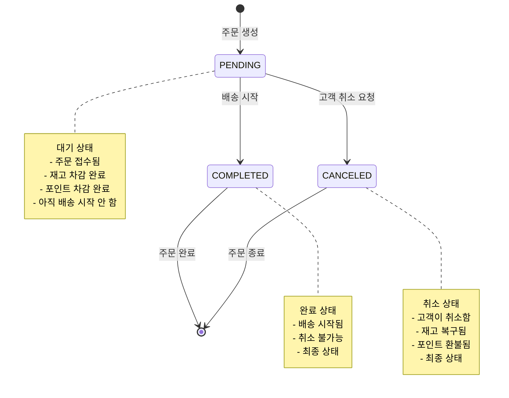
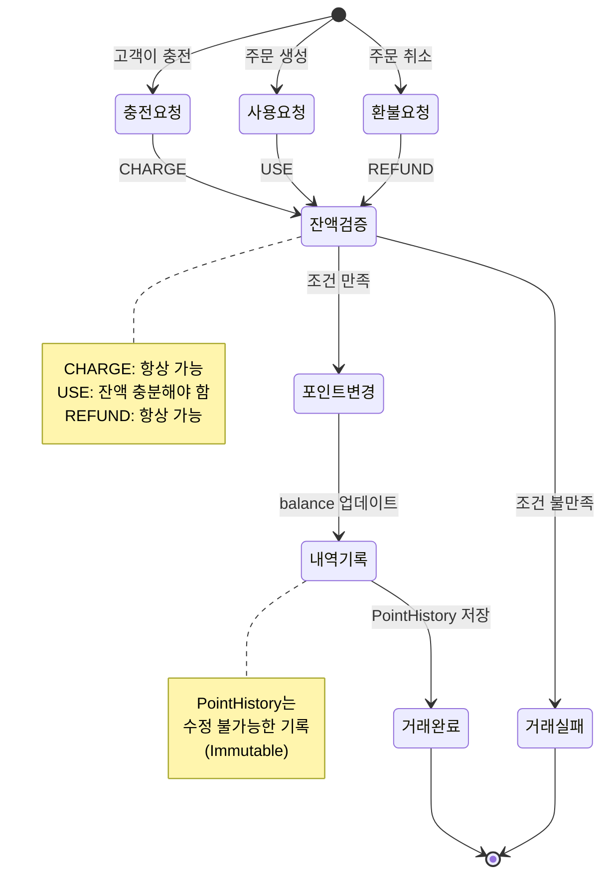

# 상태 다이어그램 (State Diagrams)

> 각 도메인 객체의 **상태가 어떻게 변화하는지**, **어떤 조건에서 전이가 일어나는지**를 시각화한 문서입니다.

## 1. 주문 상태 (Order Status)

### 💭 해결하려는 문제

**상황**
```
주문의 생명주기:
1. 고객이 주문 → PENDING (대기)
2. 배송 시작 → COMPLETED (완료)
3. 고객이 취소 → CANCELED (취소)

하지만 모든 전이가 가능한 건 아님:
✓ PENDING → COMPLETED (가능)
✓ PENDING → CANCELED (가능)
✗ COMPLETED → CANCELED (불가능 - 이미 배송 시작)
✗ CANCELED → PENDING (불가능 - 취소된 주문 재활성화 불가)
```

### 🎬 상태 전이 다이어그램



**1. 상태 전이 규칙**

| 상태 | 의미 | 다음 가능한 상태 |
|---|---|---|
| PENDING (대기) | 주문 생성, 재고·포인트 차감 완료 | COMPLETED, CANCELED |
| COMPLETED (완료) | 배송 시작됨 | 없음 (최종 상태) |
| CANCELED (취소) | 고객 취소, 재고·포인트 복구됨 | 없음 (최종 상태) |

**2. COMPLETED를 취소할 수 없는 이유**

```
[물리적 이유]
이미 상품이 배송 중이거나 배송 완료
→ 물리적으로 취소 불가능
→ 반품은 별도 프로세스

[데이터 정합성]
취소 = 재고 복구 + 포인트 환불
→ 배송 중인 상품의 재고를 복구하면?
→ 존재하지 않는 재고가 생김
```

**3. 상태 전이 시 수행되는 작업**

```
[PENDING → COMPLETED]
- 배송 정보 업데이트
- 고객에게 배송 시작 알림

[PENDING → CANCELED]
- 포인트 환불 (PointService)
- 재고 복구 (ProductService)
- 포인트 거래 내역에 REFUND 기록
- 주문 취소 시각(canceled_at) 기록
→ 모두 성공하거나 모두 실패 (트랜잭션)
```

## 2. 포인트 거래 상태 (Point Transaction)

### 💭 해결하려는 문제

**상황**
```
포인트는 단순한 잔액이 아니라 "거래의 연속"
- 충전: +10,000원 (잔액: 10,000원)
- 사용: -3,000원 (잔액: 7,000원)
- 환불: +3,000원 (잔액: 10,000원)

각 거래는 독립적이지만, 순서대로 처리되어야 함
```

### 🎬 포인트 거래 생명주기



**1. 거래 유형**

| 유형 | 트리거 | 잔액 변화 | 제약 조건 |
|---|---|---|---|
| CHARGE (충전) | 고객 충전 요청 | balance += amount | 항상 가능 |
| USE (사용) | 주문 생성 | balance -= amount | 잔액 충분해야 함 |
| REFUND (환불) | 주문 취소 | balance += amount | 항상 가능 |

**2. 왜 USE만 실패할 수 있는지**

```
[CHARGE (충전)]
잔액: 5,000원 + 10,000원 = 15,000원
→ 항상 가능

[USE (사용)]
잔액: 3,000원 - 5,000원 = ?
→ 잔액 부족! InsufficientPointException

[REFUND (환불)]
잔액: 5,000원 + 3,000원 = 8,000원
→ 항상 가능 (취소된 금액을 돌려주는 것)
```

**3. 거래 내역 예시**

```
[시나리오: 충전 → 주문 → 취소]

1. CHARGE: +10,000원 (잔액: 10,000원) "포인트 충전"
2. USE:    -5,000원  (잔액: 5,000원)  "주문 #123"
3. REFUND: +5,000원  (잔액: 10,000원) "주문 #123 취소 환불"

→ description으로 USE와 REFUND의 관계 추적
```
